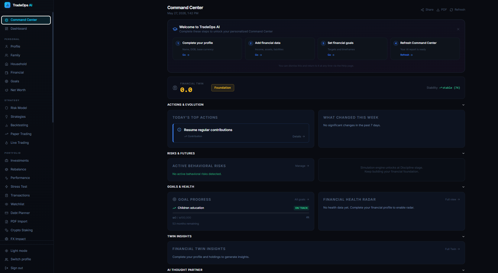
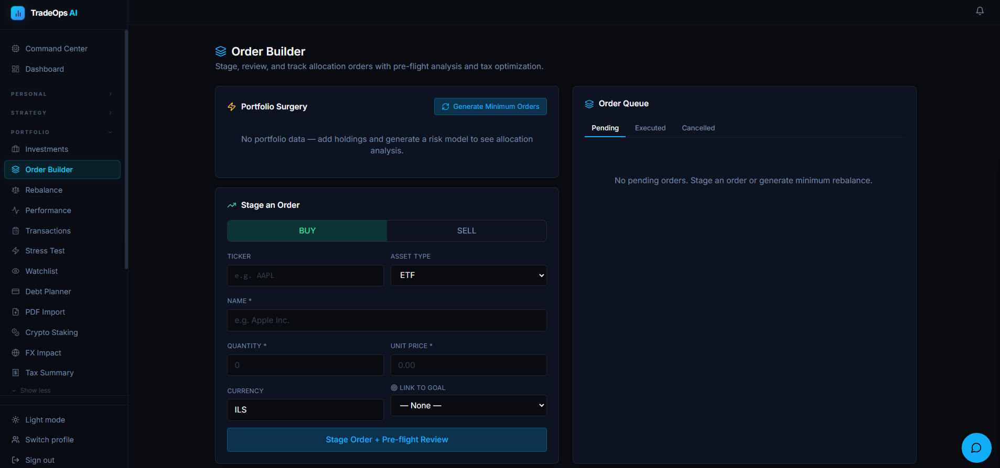
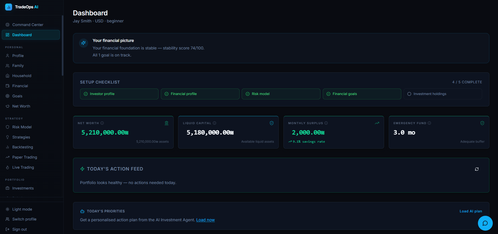
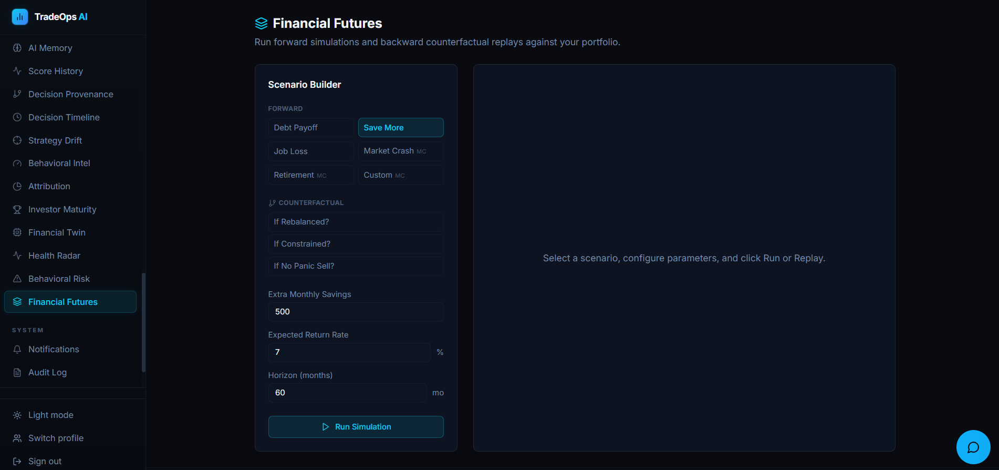

# TradeOps AI

<div align="center">

**Decision Intelligence for Investors**

[](CHANGELOG.md)
[](LICENSE)
[](https://python.org)
[](https://nextjs.org)
[](https://fastapi.tiangolo.com)
[](https://postgresql.org)
[](infra/docker-compose.yml)
[](https://github.com/erezrozenbaum/tradeops/stargazers)

*Most investing platforms track portfolios.*
*TradeOps tracks decisions.*

[**Read the vision →**](VISION.md)

<a href="https://buymeacoffee.com/erezrozenbaum">
  
</a>

</div>

---

> [!WARNING]
> **TradeOps AI is an educational and analytical financial intelligence platform.**
> It does not provide financial, investment, legal, or tax advice of any kind.
>
> All investment decisions remain solely the responsibility of the user.
> AI-generated insights, simulations, recommendations, and research outputs are analytical decision-support tools —
> they may be incomplete, delayed, inaccurate, or unsuitable for your specific financial situation.
>
> Always independently verify information and consult a licensed financial professional
> before making any investment, trading, or financial planning decision.
> Past simulated or backtested performance does not guarantee future results.
>
> Not available in jurisdictions where such tools require regulatory licensing or approval.
> See [`LEGAL_DISCLAIMER.md`](LEGAL_DISCLAIMER.md) for the full disclaimer.

---

## Table of Contents

- [The Core Insight](#the-core-insight)
- [The Decision Loop](#the-decision-loop)
- [How it works](#how-it-works)
- [Highlights](#highlights)
- [Decision Intelligence](#decision-intelligence)
- [Full Feature Reference](#full-feature-reference)
- [Architecture](#architecture)
- [Trust & Safety Architecture](#trust--safety-architecture)
- [Deployment](#deployment)
- [Quickstart](#quickstart)
- [Environment Variables](#environment-variables)
- [Documentation](#documentation)
- [Safety Principles](#safety-principles)
- [Contributing](#contributing)
- [Legal](#legal)

---

## The Core Insight

Most investing tools answer: **What happened to my money?**

TradeOps answers: **Why do I keep making the same decisions?**

That is a harder problem. And a more interesting one.

Portfolio performance is partly skill and partly luck. Decision quality is entirely within your control. A bad market can destroy a good portfolio. It cannot destroy a good decision process.

TradeOps does not compete with portfolio trackers, robo-advisors, or AI stock pickers. It measures and improves the one thing those tools ignore: **how you decide**.

| What TradeOps tracks | What it does not do |
|---|---|
| Decision quality — documented, measured, over time | Execute trades autonomously |
| Behavioral patterns from your own history | Provide licensed financial advice |
| Whether your discipline actually improves returns | Guarantee outcomes |
| Risk alignment between decisions and your model | Override deterministic risk controls |
| Decision quality month-over-month, independent of markets | Operate in place of a financial professional |

---

## The Decision Loop

Every investment decision becomes a data point. Over time, the system builds a behavioral fingerprint from your own history.

```
        Idea
          ↓
    Market Research
          ↓
    Pre-flight Review  ←  deterministic risk engine
          ↓
      Rationale        ←  write your thesis before you trade
          ↓
    Paper Testing      ←  validate before real capital
          ↓
    Stage → Execute
          ↓
  Outcome Tracking     ←  30 / 90 / 180-day results
          ↓
      Reflection       ←  auto-computed post-execution record
          ↓
  Behavioral Learning  ←  DQS, Behavioral Alpha, Monthly Review
          ↓
   Better Next Decision
```

After enough cycles, TradeOps answers questions like:
- Do your documented decisions outperform undocumented ones? (measured on your actual returns)
- What does your Decision Quality Score look like this month vs. last month?
- Which behavioral patterns — blind overrides, reactive large trades, goal drift — are costing you?

---

## How it works

TradeOps is not four products for four personas. It is one product for one investor — at every stage of the journey.

**Stage 1 — Foundation**
Before touching a strategy, the platform builds the data layer that makes decision intelligence meaningful: financial profile, stability score, risk allocation model, and goals. A beginner managing an emergency fund is building the same foundation a serious investor needs for a meaningful DQS.

**Stage 2 — Validation**
Strategy backtesting, paper trading, and pre-flight review gate every order. The platform enforces the sequence: understand before you invest, simulate before you commit, stage before you execute.

**Stage 3 — Decision Intelligence**
The layer that makes TradeOps different. Every staged order accumulates decision data — rationale, pre-flight verdict, outcome. Over time that data feeds the DQS, Behavioral Alpha, Monthly Review, and Coach. The longer you use it, the sharper your behavioral mirror becomes.

The progression is not separate products. It is the same investor growing.

---

## Highlights

<div align="center">
  
  
</div>
<div align="center">
  
  
</div>

- **Decision Quality Score** — 0–100 score measuring HOW you make decisions, not whether markets cooperated. Improvable in a bear market.
- **Behavioral Alpha** — Three original alpha dimensions (Documentation Alpha, Goal Alignment Alpha, Risk Compliance Alpha) measured on your actual trade returns. Not theory — your history.
- **Command Center** — A single daily intelligence screen: top actions, 7-day evolution feed, behavioral warnings, futures preview, and AI summary.
- **Order Builder** — Stage orders with deterministic pre-flight review, tax-optimised sequencing, goal linkage, and 30/90/180-day outcome tracking.
- **5-gate live trading safety model** — Paper track record (Sharpe ≥ 0.5, ≥ 30 days) + risk acknowledgment + admin approval + order risk limits + verified broker connection.

---

## Decision Intelligence

The features that make TradeOps different from every portfolio tracker and robo-advisor.

| Feature | What it does |
|---|---|
| **Trade Journal** | Captures rationale (written thesis) and auto-computed reflection on every staged order — preflight verdict, risks flagged, whether thesis was documented |
| **Decision Quality Score (DQS)** | 0–100 score measuring HOW decisions are made, independent of market performance; four components: Documentation Discipline, Risk Intelligence, Goal Alignment, Outcome Correlation; monthly trend |
| **Outcome Correlation** | Shows whether your documented decisions outperform undocumented ones — using your actual returns from the live price cache, not theory |
| **Behavioral Alpha** | Three original alpha dimensions: Documentation Alpha, Goal Alignment Alpha, Risk Compliance Alpha — each shows group avg return, win rate, and outperformance delta from your own history |
| **Mistake Pattern Detection** | Automatically surfaces recurring failure modes: blind risk overrides, undocumented losses, large reactive trades, systematic goal drift |
| **Monthly Investor Review** | Deterministic month-in-review: headline, DQS delta vs. prior month, decision quality narrative, behavioral narrative, improvement focus, achievements, watch list |
| **Behavioral Insights** | Up to 6 pattern cards per DQS refresh categorised as strength / warning / pattern / opportunity |
| **Coach Notes** | 2–3 data-derived, non-generic improvement nudges specific to your observed patterns |
| **Financial Twin** | 8-dimensional behavioral mirror updated daily: Stability, Discipline, Emotional Risk, Consistency, Resilience, Risk Alignment, Long-Term Discipline, Contribution Momentum |
| **Behavioral Risk Warnings** | 7 deterministic detection rules (panic selling, performance chasing, revenge trading, overtrading spike, concentration addiction, risk creep, strategy abandonment) |

---

## Full Feature Reference

### Foundation — Build the data layer that makes Decision Intelligence meaningful

| Feature | Description |
|---|---|
| **Investor & Family profiles** | Household financial modeling, dependents, education mode for minors |
| **Financial profile** | Income, expenses, savings rate, debts, assets, liabilities |
| **Financial Stability Score** | Deterministic 0–100 score — restricts aggressive strategies when fragile |
| **Risk Allocation Model** | Percentage-based investable capital per risk tier (not vague low/medium/high) |
| **Goals engine** | Linked accounts, progress tracking, monthly contribution gap analysis |
| **Net Worth Dashboard** | Full balance sheet: portfolio + manual assets − liabilities, 12-month trend, FI projection |

### Portfolio Intelligence — Understand what's happening in your portfolio

| Feature | Description |
|---|---|
| **Investment accounts & holdings** | Multi-account, multi-currency, all asset types |
| **Live price refresh** | Alpha Vantage / yfinance with 24h cache; SSE streaming (30s interval) |
| **FX Impact** | P&L split into Asset P&L (price movement) vs Currency P&L (FX movement) |
| **Performance attribution** | TWR, MWR (IRR), alpha vs benchmark, per-holding CAGR |
| **Rebalancing engine** | Actionable BUY/SELL suggestions per allocation tier; dedicated `/rebalance` page with tier bars and suggested trades |
| **Correlation matrix** | 90-day Pearson correlation, concentration risk flags |
| **Stress testing** | 5 historical crash scenarios + Monte Carlo P10/P50/P90 |
| **Tax-loss harvesting** | Candidates sorted by estimated saving, wash-sale warnings |
| **Tax Year Summary** | WACC-method realized gains, year-over-year P&L, estimated 25% flat tax; one-click CSV export |
| **Liquidity runway** | T+2 / 1-week / locked tier breakdown, emergency liquidation path |
| **Resilience simulator** | Job loss / expense shock survival score with depletion path |

### Strategy & Simulation — Validate before you commit real capital

| Feature | Description |
|---|---|
| **Strategy library** | Curated templates matched to risk model and suitability |
| **Backtesting** | Deterministic seeded simulation engine |
| **Paper trading** | Real virtual trading: buy/sell any ticker, live price fetch with automatic FX conversion to portfolio currency, WACC positions, order history |
| **Pairs trading** | Statistical arbitrage: OLS hedge ratio, ADF cointegration, Z-score signals |

### AI Intelligence *(requires `ANTHROPIC_API_KEY`)*

> All AI features produce **decision-support outputs only**. No AI feature executes trades or constitutes financial advice.

| Feature | Description |
|---|---|
| **AI Coach** | Proactive rule-based + AI-narrated insights: emergency fund, idle cash, goal gaps, concentration risk, tax-loss opportunities |
| **AI Report** | Full portfolio analysis generated by Claude |
| **AI-assisted Suggestions** | Tailored picks matched to risk model, goals, and holdings |
| **Deep Market Research** | Screens 63 instruments; AI investment theses, 3-tier portfolio; persistent history |
| **AI Agent** | Free-form financial assistant grounded in real portfolio data |
| **AI Portfolio Chat** | Natural language Q&A, 5-turn context window |
| **Market Signal Monitor** | Daily news sentiment + whale mention detection per holding |
| **Daily Action Feed** | Aggregated morning briefing: suggested actions, prioritised |
| **AI Weekly Digest** | Friday email with portfolio performance and 1–3 suggestions |

### Data Import

| Feature | Description |
|---|---|
| **Broker Import** | IBKR Flex XML, eToro CSV, Altshuler Shaham, ALTrade (XLSX/CSV) |
| **IBKR REST Sync** | Live position sync from IBKR Client Portal Gateway |
| **PDF Statement Import** | AI-powered parsing of any broker PDF format |
| **Broker Auto-Sync** | Daily scheduled sync for connected accounts |
| **Crypto Staking Tracking** | APY-based staking rewards as income |
| **Options tracking** | Call/put with strike/expiry/multiplier; long/short P&L |

### Live Trading *(Gated — disabled by default)*

| Feature | Description |
|---|---|
| **5-gate readiness check** | Paper track record (Sharpe > 0.5, ≥30 days), risk acknowledgment, admin approval, order risk limits, IBKR connection |
| **Risk acknowledgment gate** | Explicit multi-point user acknowledgment required before any session activation |
| **Live trading admin queue** | Admin panel: eligible investors, gate status, Sharpe ratio; Approve/Revoke with audit trail |
| **IBKR Client Portal Gateway** | Market and limit orders; cancellation; position sync |
| **Kill switch** | Halts session and cancels all open orders immediately |

### Operational

| Feature | Description |
|---|---|
| **JWT authentication** | HS256, HttpOnly `SameSite=Strict` cookie; cookie + `Authorization: Bearer` |
| **Token revocation** | Redis JTI blacklist on logout; in-memory fallback |
| **Role-based access** | `user` and `admin` roles; all 35+ investor routes enforce ownership |
| **Audit log** | Every significant action recorded |
| **Admin panel** | User management, AI cost tracking per feature |
| **Login rate limiting** | 5 attempts per IP per 5-minute window (Redis-backed) |
| **AI monthly budget guard** | Configurable per-investor USD spending cap |
| **PWA** | Installable, offline-capable |
| **Dark / light mode** | Toggle in sidebar; dark default; persisted via `next-themes` |
| **Mobile-first UI** | Responsive sidebar, touch-friendly layouts |
| **Kubernetes / Helm** | Production-hardened chart with NetworkPolicy, PDB, securityContext |

### Financial Command Center *(v2.8.0)*

| Feature | Description |
|---|---|
| **Today's Command Center** | Unified daily intelligence screen — answers "What should I focus on next, and why?" Replaces the dashboard as the primary landing page |
| **Top 3 Prioritized Actions** | Rule-based action engine ranks the highest-impact next steps (emergency fund, concentration risk, behavioral warnings, contribution gaps) — adapted to maturity stage |
| **7-Day Financial Evolution Feed** | Delta feed comparing key metrics (Twin score, stability, behavioral risk, net worth) vs 7 days ago; explains what changed and why |
| **Health Radar Inline** | 8-dimension radar chart surfaced on the main screen — instant financial clarity |
| **Financial Twin Insights** | Positive drivers and drag factors that are actually shaping financial progress |
| **Behavioral Risk Surface** | Active warnings shown inline — no need to navigate to a separate page |
| **Parallel Futures Preview** | Simplified 3-path projection (current / +savings / debt-free) with FI probability — links to full simulation |
| **Decision Replay Highlight** | Most impactful counterfactual insight surfaced on the main screen |
| **Maturity-Aware AI Summary** | AI Thought Partner summary adapts tone and depth to investor's maturity stage; inline verbosity toggle |
| **Investor Progression Track** | Stage progression bar + unlocked features + next unlock target |

### Dashboard Intelligence *(v3.8.0)*

| Feature | Description |
|---|---|
| **Narrative Header** | Personalised 2–3 sentence financial snapshot at dashboard top; composed from stability score, EF months, goal status, and portfolio P&L; no extra API call |
| **"Why this matters" tooltips** | `MetricTooltip` component on all 4 stat cards, Financial Stability, Risk Allocation, and Max Drawdown; plain-English explanation of each metric |
| **Progressive disclosure** | "Show full picture" toggle below the stability section; collapses portfolio, goals, pension, retirement, earnings, and news; preference persisted in `localStorage` |
| **Smart empty states** | First-time users see three actionable setup cards instead of a blank message — each describes exactly what it unlocks |

### Financial Life Timeline *(v3.9.0)*

| Feature | Description |
|---|---|
| **Unified narrative timeline** | `/timeline` page merges AI recommendations, coach insights, rebalances, transactions, behavioral risk events, and AI assessment snapshots into a single chronological feed |
| **Score evolution strip** | Three live sparklines at the top: Twin Score trend, Maturity Score trend, Net Worth trend — with delta indicators vs previous snapshot |
| **AI Assessment cards** | Periodic AI narrative snapshots surfaced inline on the timeline with metric pills (twin score, stability, EF months, maturity stage) and expandable full text |
| **Month grouping** | Events grouped by calendar month with event count; longer history stays navigable |
| **1m / 3m / 6m / 1yr range** | Configurable look-back; all data sources re-fetch together |
| **Event-type filters** | All \| AI Recs \| Coach \| Rebalance \| Transactions \| Behavioral \| Assessments |
| **Behavioral risk events** | Severity-coded left border (red = high, amber = medium); evidence and recommendation surfaced inline |
| **Causal notes** | Impact annotations on events where downstream portfolio effect was measurable (e.g. "followed by −6.2% drawdown over 7 days") |

### UX Depth & Onboarding *(v3.10.0)*

| Feature | Description |
|---|---|
| **MetricTooltip expansion** | "Why this matters" inline tooltips now cover Risk Model page (Investable Capital, Max Drawdown, all three tiers), Backtesting page (Annualised, Max Drawdown, Sharpe, Win Rate), and Command Center status header (Twin Score, Stability) |
| **AI Thought Partner depth** | Collapsible "What your AI is seeing right now" panel shows Twin score 7-day delta, active behavioral risk count, and up to 3 notable evolution items with severity-coded chips — sourced from existing report data, no new API calls |
| **Onboarding wizard** | `/onboarding` — 4-step guided setup (Profile → Finances → Goals → Risk Model); detects completed steps automatically; progress bar; each step shows what it unlocks |

### Staged Allocations & Order Builder *(v3.13.0–v3.14.0)*

| Feature | Description |
|---|---|
| **Order Builder** | Portfolio Surgery panel: visual tier allocation bars with before/after deltas; stage BUY/SELL orders with deterministic pre-flight review (reasons, risks, verdict) |
| **Minimum-trade rebalancing** | One-click "Generate Minimum Orders" creates the smallest set of trades to bring the portfolio within tier targets; sells sequenced before buys |
| **Tax-optimised sequencing** | Each order tagged with tax context: loss-harvest candidates, wash-sale warnings (30-day rule), gain/loss classification |
| **Goal-linked execution** | Link any staged order to a financial goal; projected goal progress shown inline |
| **Projected metrics** | Before committing an order: projected portfolio value, tier allocation %, goal progress |
| **Template Library** | Save a set of staged orders as a named template; apply to re-stage with fresh pre-flight; delete when done |
| **Outcome Tracking** | For executed orders: projected metrics (captured at staging time) vs actual outcome at 30 / 90 / 180 days; closes the execution loop |

### Contextual Intelligence Surface *(v3.12.0)*

| Feature | Description |
|---|---|
| **Next Best Action bar** | Persistent slim strip on every page (except Dashboard/Command Center/Onboarding) showing the single highest-priority action item; expand for reasoning; "Act →" routes to the relevant page; cycle and dismiss with localStorage persistence |

### Notification & Navigation Surface *(v3.11.0)*

| Feature | Description |
|---|---|
| **Notification Bell** | Bell icon in desktop header and mobile topbar; red badge count; dropdown with dismissable alert items; feeds from existing notifications API — no new backend calls |
| **Desktop header strip** | Persistent 48px header bar on desktop layout housing the notification bell; ensures alerts are always accessible without navigating away |
| **Setup Guide sidebar link** | `/onboarding` linked from sidebar System section as "Setup Guide" (Sparkles icon) |
| **Goals MetricTooltip** | "Total monthly needed" and per-goal "Needs X/mo" now have "Why this matters" explanations |
| **Dashboard guided setup CTA** | SmartEmptyState shows "Guided setup →" link to `/onboarding` alongside existing step cards |

### Observability & Data Integrity *(v2.7.1)*

| Feature | Description |
|---|---|
| **Langfuse AI tracing** | Every AI call traced: feature, model, tokens, input/output. Full prompt history, replay, and quality scoring. Optional — no-op when keys absent. |
| **Prometheus metrics** | `/metrics` endpoint: request rate, p50/p95/p99 latency, error rate, in-progress count, per-endpoint breakdown |
| **Grafana dashboard** | Pre-provisioned at `:3001` — wired to Prometheus with TradeOps backend dashboard out of the box |
| **Great Expectations** | 5 data quality suites validate financial tables daily: no negative quantities, positive FX rates and prices, valid currency codes, portfolio snapshot integrity |
| **Migration safety CI** | Every PR runs Alembic upgrade + table count check + downgrade round-trip against a real Postgres container |

---

## Architecture

```
┌─────────────────────────────────────────────────────────────┐
│                    Browser (Next.js 16)                      │
│              REST/JSON + SSE · HttpOnly Cookie               │
└─────────────────────────┬───────────────────────────────────┘
                          │
┌─────────────────────────▼───────────────────────────────────┐
│                FastAPI (Python 3.11)                         │
│                                                              │
│  ┌────────────────┐  ┌─────────────────┐  ┌──────────────┐  │
│  │ Deterministic  │  │   AI Layer      │  │  Workers     │  │
│  │ Risk Engine    │  │  Claude API     │  │  APScheduler │  │
│  │ Score · Rebal  │  │  (traced via    │  │  14 daily    │  │
│  │ Gate · Backtest│  │   Langfuse)     │  │  jobs        │  │
│  └────────────────┘  └─────────────────┘  └──────────────┘  │
│                  │ SQLAlchemy ORM                            │
└──────────────────┼──────────────────────────────────────────┘
                   │
    ┌──────────────┴───────────────┐
    │                              │
┌───▼─────────┐          ┌─────────▼──────┐
│ PostgreSQL  │          │  Redis 7       │
│ 16          │          │                │
│ 40+         │          │ · Rate limit   │
│ migrations  │          │ · JWT blacklist│
└─────────────┘          └────────────────┘
```

All services run as Docker containers. Helm chart at `helm/tradeops/` for Kubernetes.

**Key design decisions:**
- The **deterministic Risk Engine** always runs before any AI suggestion. AI cannot override risk controls.
- AI features are **decision-support only** — they never trigger trades, never bypass safety gates.
- **Paper trading is required** before any live trading session can be approved.
- Every significant action is **audit-logged** with full context.

See [`docs/architecture.md`](docs/architecture.md) for the full module and routing reference.

---

## Trust & Safety Architecture

TradeOps is built deterministic-first. Every layer has a defined role and cannot be bypassed by the layer above it.

```
User action
    ↓
Deterministic Risk Engine  ← always runs first, AI cannot override
    ↓
AI decision-support layer  ← interprets, explains, suggests; never executes
    ↓
Safety gates (5-check live trading)  ← block live execution unless all pass
    ↓
Audit log  ← every significant action recorded with full context
```

### What this means in practice

| Concern | How it is enforced |
|---|---|
| **AI cannot execute trades** | All orders route through the deterministic Risk Engine; AI has no order-placement path |
| **AI cannot override risk limits** | Risk Engine runs before any AI suggestion is shown; limits are code, not prompts |
| **Live trading disabled by default** | Requires: paper track record (Sharpe ≥ 0.5, ≥ 30 days) + risk acknowledgment + admin approval |
| **Every AI call is traced** | Langfuse records feature, model, token counts, input (truncated), output, investor_id for every call |
| **Financial data quality validated daily** | Great Expectations runs 5 suites at 02:00 UTC; failures written to audit log |
| **DB migrations tested on every push** | CI runs Alembic upgrade → table count check → downgrade → upgrade on a real Postgres container |
| **Metrics exposed for monitoring** | Prometheus `/metrics` endpoint; pre-provisioned Grafana dashboard at `:3001` |
| **All significant actions audit-logged** | Immutable `audit_events` table records every operation with investor context |
| **Minors are education-only** | `guardian_required` flag enforced at the risk modeling layer; live trading blocked |
| **The system can say "don't invest yet"** | Financial Stability Score may restrict aggressive strategies; high debt triggers debt-first recommendation |

This architecture makes TradeOps auditable by design — not as an afterthought.

### Explainable Financial Cognition (v1.5.0–v2.0.0)

TradeOps goes beyond recommendations to build longitudinal financial understanding:

| Feature | What it does |
|---|---|
| **Decision Provenance** | Every AI recommendation, coach insight, and rebalance is recorded with full frozen inputs — risk model snapshot, holdings, market signals, token counts |
| **Decision Replay** | Re-run any past AI recommendation on its original frozen inputs to test non-determinism and counterfactual reasoning |
| **Decision Timeline** | Unified chronological feed merging AI events and portfolio transactions; causal notes show portfolio impact in the 7 days following each decision |
| **Strategy Drift Detection** | Compares actual portfolio tier allocation (low-risk / growth / high-risk) against risk model targets; alignment score 0–100 |
| **Behavioral Intelligence** | Detects trading patterns (overtrading, long-term discipline, strategy follow-through) from 12 months of transaction history; behavioral score 0–100 |
| **Performance Attribution** | Breaks portfolio value change into capital deployed, market return, and fees drag; multi-dimensional confidence score per attribution result |
| **Investor Maturity Engine** | Deterministic 4-stage scoring (Foundation → Discipline → Optimization → Advanced Cognition) across 8 weighted dimensions; unlocks features as the investor matures; refreshed weekly |
| **Financial Twin** | 8-dimensional behavioral mirror (Stability, Discipline, Emotional Risk, Consistency, Resilience, Risk Alignment, Long-Term Discipline, Contribution Momentum); updated daily; SVG radar chart |
| **Financial Health Radar** | 9-dimensional financial health score (Stability, Liquidity, Discipline, Diversification, Emotional Control, Contribution Consistency, Tax Efficiency, Risk Alignment, Resilience); co-computed with Twin |
| **Behavioral Risk Warnings** | 7 deterministic detection rules (panic selling, performance chasing, revenge trading, overtrading spike, concentration addiction, risk creep, strategy abandonment); active/resolved event tracking; daily background scan |
| **Extended Attribution** | 3 supplementary illustrative estimates added to the Attribution page: Behavioral Drag (short-term trade fees), FX Drag (currency movement P&L), Concentration Cost (losses from top-3 concentrated holdings) |
| **Simulation Engine** | 6 financial futures scenarios: 3 deterministic (Debt Payoff, Save More, Job Loss) + 3 Monte Carlo / 1 000-iteration seeded (Market Crash, Retirement, Custom); p10/p50/p90 trajectory chart; fully reproducible; required disclaimer on every run |
| **Counterfactual Replay** | 3 backward-looking what-if replays forked from historical decision points: Rebalance (follow recommendation), Constraint (enforce allocation rule from first violation), Hold (reverse panic-sell); dual-path chart showing counterfactual vs actual path; delta and delta % |
| **Maturity-Aware AI Thought Partner** | AI Investment Agent adapts communication style to the investor's maturity stage (Foundation → Advanced Cognition); injects twin snapshot + behavioral risk history into every prompt; `?verbosity=beginner\|standard\|advanced` override |

These features share a common foundation: all significant decisions are recorded with deterministic inputs and AI outputs, making the entire decision history queryable, explainable, and auditable.

---

## Deployment

Fully automated one-command deployment via the included scripts.

### Windows

```powershell
.\deploy.ps1
```

Modes: `.\deploy.ps1 -Stop` · `.\deploy.ps1 -Update` · `.\deploy.ps1 -Reset` · `.\deploy.ps1 -Monitoring`

### Linux / macOS

```bash
chmod +x deploy.sh
./deploy.sh
```

Modes: `./deploy.sh --stop` · `./deploy.sh --update` · `./deploy.sh --reset` · `./deploy.sh --monitoring`

Both scripts:
- Verify Docker and system requirements (disk ≥ 15 GB, RAM ≥ 6 GB)
- Generate cryptographic secrets (JWT key, DB password, Redis password) automatically
- Prompt for your Anthropic API key (optional — AI features only)
- Build and launch all Docker services
- Wait for health checks and print access URLs

---

## Quickstart

### Prerequisites

- [Docker Desktop](https://www.docker.com/products/docker-desktop/) 24.x+
- `ANTHROPIC_API_KEY` — optional, enables all AI features

### 1. Clone and configure

```bash
git clone https://github.com/erezrozenbaum/tradeops.git
cd tradeops
cp backend/.env.example backend/.env
```

Edit `backend/.env` and set at minimum:

```env
JWT_SECRET_KEY=your-32-char-minimum-secret-key-here
ANTHROPIC_API_KEY=sk-ant-...   # optional — AI features only
```

### 2. Start

```bash
# Windows
.\deploy.ps1

# Linux / macOS
./deploy.sh
```

Or directly with Docker Compose:

```bash
docker compose -f infra/docker-compose.yml up -d
```

Database migrations run automatically on backend startup.

### 3. Open

| Service | URL |
|---------|-----|
| App | http://localhost:3000 |
| API docs | http://localhost:8000/docs |

### 4. Create your first account

Visit http://localhost:3000, register, then follow the onboarding flow:

```
Profile → Financial → Goals → Risk Model → Strategies → Paper Trade
```

---

## Environment Variables

| Variable | Required | Description |
|----------|----------|-------------|
| `DATABASE_URL` | Yes | PostgreSQL connection string |
| `JWT_SECRET_KEY` | Yes | HS256 signing key (min 32 chars) |
| `ANTHROPIC_API_KEY` | No | Enables all AI features |
| `ALPHA_VANTAGE_API_KEY` | No | Higher price fetch rate limit |
| `WORKERS_ENABLED` | No | `true` to enable background jobs |
| `REDIS_URL` | No | Redis URL (e.g. `redis://redis:6379/0`). Falls back to in-memory if unset. |
| `SMTP_HOST/USER/PASS` | No | Required for weekly digest emails |
| `ALLOWED_ORIGINS` | No | CORS origins (comma-separated) |

---

## Documentation

| Doc | Description |
|-----|-------------|
| [`VISION.md`](VISION.md) | The product story — the problem, why existing tools fail, DQS, Behavioral Alpha, Outcome Correlation. Start here if you're not an engineer. |
| [`docs/architecture.md`](docs/architecture.md) | Full module map, API routing, frontend structure, worker schedule |
| [`docs/schema.md`](docs/schema.md) | Complete DB schema + 50-migration history |
| [`docs/admin-guide.md`](docs/admin-guide.md) | Installation, Kubernetes, operations, troubleshooting |
| [`CHANGELOG.md`](CHANGELOG.md) | Full version history |
| [`LEGAL_DISCLAIMER.md`](LEGAL_DISCLAIMER.md) | Full legal disclaimer, risk disclosure, AI limitations |
| [`SECURITY.md`](SECURITY.md) | Security policy, known CVEs, vulnerability reporting |
| [`CONTRIBUTING.md`](CONTRIBUTING.md) | Development setup, code standards, PR process |

---

## Safety Principles

These are non-negotiable and enforced in code — not just policy:

1. **AI never directly executes trades** — every order goes through the deterministic Risk Engine
2. **Live trading disabled by default** — requires paper track record (Sharpe ≥ 0.5, ≥ 30 days) + admin approval + explicit risk acknowledgment
3. **Every order passes the Risk Engine** — max position size, max open positions, concentration limits
4. **Strategy recommendations from curated templates only** — AI cannot invent strategies
5. **Minors are education-only by default** — `guardian_required` flag enforced at the risk modeling layer
6. **The system can recommend "don't invest yet"** — financial stability score may block aggressive strategies
7. **The system can recommend debt reduction first** — high-interest debt is flagged before investment
8. **All significant actions are audit-logged** — full context, immutable

---

## Contributing

Contributions are welcome. See [CONTRIBUTING.md](CONTRIBUTING.md) for development setup, code standards, and the PR process.

For security issues, see [SECURITY.md](SECURITY.md) — please do not open a public issue for vulnerabilities.

---

## Legal

TradeOps AI is **not a registered investment advisor, broker, or financial institution**.

It is educational and analytical software. See [`LEGAL_DISCLAIMER.md`](LEGAL_DISCLAIMER.md) for:
- No financial advice disclaimer
- Risk disclosure
- AI limitations and accuracy
- Third-party data disclaimer
- Tax disclaimer
- Live trading risk
- Jurisdiction disclaimer
- Open-source warranty ("AS IS")

---

## License

MIT — see [LICENSE](LICENSE) for details.

> THE SOFTWARE IS PROVIDED "AS IS", WITHOUT WARRANTY OF ANY KIND.
> TradeOps AI is not a licensed financial advisor, broker, or portfolio manager.
> Use entirely at your own risk.
