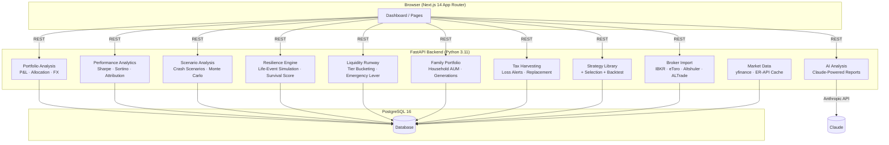
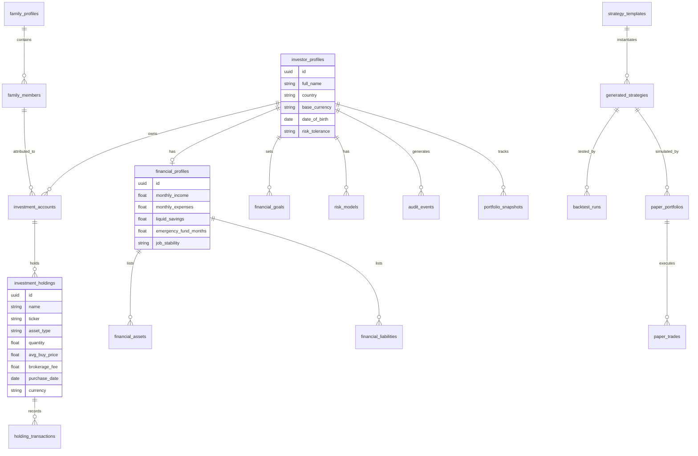

# TradeOps AI

Personal Financial Intelligence Platform — AI-assisted financial analysis, strategy recommendation, backtesting, and paper trading.

> **MVP status.** Live trading is intentionally disabled. The system is designed for financial education, analysis, and validated simulation only.

---

## What it does

```
Investor Profile → Financial Context → Risk Model → Portfolio Tracking → Strategy → Backtest → Paper Trade → AI Report
```

1. **Investor & financial profiling** — personal data, income/expenses, assets, debts, goals, investment preferences
2. **Financial stability scoring** — deterministic engine assessing readiness to invest
3. **Risk allocation model** — percentage-based capital allocation with age-based safety rules and enforcement fields
4. **Investment decision engine** — deterministic readiness assessment: ready / ready with limits / not ready / education only
5. **Portfolio tracking** — manually add existing investment accounts and holdings; track P&L, asset allocation, and currency exposure across all accounts
6. **Multi-currency support** — FX rates cached from open.er-api.com; all values normalised to investor's base currency
7. **Market data** — live prices via yfinance (24h cache); "Refresh prices" updates all tickered holdings; price source shown per holding (`live` / `manual` / `cost_basis`)
8. **Strategy recommendations** — ranked list from a curated template library
9. **Backtesting** — deterministic simulation of strategy performance over configurable periods
10. **Paper trading** — month-by-month portfolio simulation without real capital
11. **AI financial report** — Claude-powered 7-section narrative analysis
12. **Performance attribution** — holding-level contribution to return, rolling returns (1M/3M/6M/1Y), alpha vs TA-35 / S&P 500 benchmark (currency-aware)
13. **Scenario analysis & stress testing** — 5 historical crash scenarios applied to portfolio tiers + Monte Carlo P10/P50/P90 fan chart to retirement
14. **Dividend & income calendar** — forward annual dividend income per holding, yield-on-value/cost, upcoming ex-dividend dates (90-day window)
15. **Tax-loss harvesting alerts** — identifies holdings with unrealized losses >5% that can offset gains; estimates tax saving; flags short-term vs long-term holdings and wash-sale risk
16. **Professional PDF report** — multi-page client-grade PDF export (cover page, portfolio overview, performance analytics, stress test, tax summary); monthly or quarterly; generated on demand via `reportlab`
17. **Beta vs benchmark** — portfolio market sensitivity (Cov/Var regression); displayed alongside Sharpe/Sortino on the Performance page
18. **Per-holding CAGR** — annualised return since purchase date shown for each contributor and detractor in attribution
19. **Price staleness warning** — amber banner when any tickered holding falls back to cost basis (no live market price available)
20. **Fee-inclusive cost basis** — brokerage fees are now included in cost basis for correct P&L calculation
21. **Pension fund tax correction** — pension and study funds exempt from flat 25% CGT; taxed as income at withdrawal
22. **Single-stock concentration flag** — correlation engine warns when any single ticker > 15% of portfolio value
23. **Family Consolidated View** — household AUM aggregated across all family members grouped by generation; cross-member ticker overlap detection; education-mode badges for minors (age < 18)
24. **Liquidity Runway Engine** — tiers every holding by settlement speed (T+2 / 1wk / Locked); net-to-pocket = gross − estimated CGT − market impact; Emergency Lever greedily selects cheapest holdings to sell to meet a cash target
25. **Resilience Stress-Test** — simulates a life-event scenario (job loss, expense spike) by draining cash reserve → Tier 1 → Tier 2 in cost-efficiency order; produces a Survival Score (0–100), depletion timeline, and optional Claude-generated recommendation

---

## Tech stack

| Layer      | Technology                              |
|------------|-----------------------------------------|
| Backend    | Python 3.11, FastAPI, SQLAlchemy, Alembic |
| Database   | PostgreSQL 16                           |
| Frontend   | Next.js 14 (App Router), Tailwind CSS, Recharts |
| AI         | Anthropic Claude API                    |
| Container  | Docker, Docker Compose                  |
| CI         | GitHub Actions                          |

---

## Quick start (Docker Compose)

### Prerequisites
- Docker Desktop
- Anthropic API key (for AI report generation)

### 1. Clone

```bash
git clone https://github.com/erezrozenbaum/tradeops.git
cd tradeops
```

### 2. Configure environment

```bash
cp backend/.env.example backend/.env
```

Edit `backend/.env`:

```env
DATABASE_URL=postgresql://tradeops:tradeops@db:5432/tradeops
ANTHROPIC_API_KEY=sk-ant-...
SECRET_KEY=change-me-in-production
```

### 3. Start

```bash
cd infra
docker compose up
```

This will:
- Start PostgreSQL
- Run `alembic upgrade head` (schema migrations + strategy template seed)
- Start the FastAPI backend on `http://localhost:8000`
- Start the Next.js dev server on `http://localhost:3000`

### 4. Open the app

Go to [http://localhost:3000](http://localhost:3000).  
On first run, the login page will open the profile creation form automatically — fill in your details and you'll be taken straight to the dashboard.

---

## Development (local, without Docker)

### Backend

```bash
cd backend
python -m venv .venv
source .venv/bin/activate        # Windows: .venv\Scripts\activate
pip install -r requirements.txt
# set DATABASE_URL in backend/.env pointing to a local or Docker PostgreSQL
alembic upgrade head
uvicorn app.main:app --reload
```

API docs available at [http://localhost:8000/docs](http://localhost:8000/docs).

### Frontend

```bash
cd frontend
npm install
npm run dev
```

App available at [http://localhost:3000](http://localhost:3000).

---

## Project structure

```
tradeops/
├── backend/
│   ├── app/
│   │   ├── api/v1/router.py        # Route assembly
│   │   ├── models/                  # SQLAlchemy ORM models
│   │   ├── schemas/                 # Pydantic request/response schemas
│   │   ├── investor_profiles/
│   │   ├── financial_profiles/
│   │   ├── family_profiles/
│   │   ├── goals/
│   │   ├── financial_scoring/       # Stability score engine
│   │   ├── risk_modeling/
│   │   ├── strategy_library/
│   │   ├── strategy_selection/
│   │   ├── backtesting/             # Simulation engine
│   │   ├── paper_trading/
│   │   ├── financial_decision/      # Investment readiness engine
│   │   ├── holdings/                # Investment accounts + holdings CRUD
│   │   ├── currency_engine/         # FX rate fetch + conversion
│   │   ├── portfolio_analysis/      # P&L, allocation, currency exposure
│   │   ├── performance_analytics/   # Sharpe, Sortino, drawdown, attribution
│   │   ├── scenario_analysis/       # Historical crash scenarios + Monte Carlo
│   │   ├── income_projection/       # Dividend income per holding + ex-date calendar
│   │   ├── tax_harvesting/          # Tax-loss harvesting opportunity detection
│   │   ├── tax_rules/               # Country-specific CGT rules for AI context
│   │   ├── family_portfolio/        # Household portfolio aggregation by family member + generation
│   │   ├── liquidity_runway/        # Liquidity tiering + net-to-pocket + emergency lever
│   │   ├── resilience/              # Life-event depletion simulation + survival score
│   │   ├── reports/                 # PDF report generation (reportlab)
│   │   ├── ai_analysis/             # Claude integration
│   │   ├── audit/
│   │   └── dashboard/
│   ├── alembic/versions/            # DB migrations
│   └── tests/
├── frontend/
│   └── src/app/
│       ├── (auth)/login/            # Login + profile creation
│       └── (dashboard)/
│           ├── dashboard/           # Overview + Investment Readiness + Portfolio widget
│           ├── investments/         # Account + holdings tracking, portfolio summary, dividend income
│           ├── performance/         # Equity curve, risk metrics, attribution, tax opportunities
│           ├── stress-test/         # Scenario analysis + Monte Carlo fan chart
│           ├── financial/           # Financial profile + assets/liabilities
│           ├── goals/
│           ├── family/
│           ├── profile/             # Investor profile + investment preferences
│           ├── risk/
│           ├── strategies/
│           ├── backtesting/
│           ├── paper-trading/
│           ├── reports/
│           ├── audit/
│           └── settings/
├── infra/
│   └── docker-compose.yml
└── docs/
    ├── architecture.md
    ├── admin-guide.md
    └── project_spec.md
```

---

## API reference

Interactive docs: `http://localhost:8000/docs` (Swagger UI)

Key endpoints:

| Method | Path | Description |
|--------|------|-------------|
| GET/POST | `/api/v1/investors` | List / create investor profiles |
| GET/PUT | `/api/v1/investors/{id}` | Get / update investor profile |
| GET/POST/PUT | `/api/v1/investors/{id}/financial-profile` | Financial profile |
| GET/POST | `/api/v1/investors/{id}/risk-model` | Risk allocation model |
| GET | `/api/v1/investors/{id}/decision` | Investment readiness decision |
| GET | `/api/v1/investors/{id}/portfolio` | Portfolio analysis (P&L, allocation, exposure) |
| POST | `/api/v1/investors/{id}/portfolio/refresh-prices` | Force-refresh market prices for all tickered holdings |
| GET | `/api/v1/investors/{id}/portfolio/analytics` | Risk-adjusted metrics (Sharpe, Sortino, drawdown, benchmark) |
| GET | `/api/v1/investors/{id}/portfolio/attribution` | Holding-level attribution + rolling returns + alpha |
| GET | `/api/v1/investors/{id}/portfolio/history` | Historical portfolio snapshots (1m/3m/6m/1y/all) |
| GET | `/api/v1/investors/{id}/portfolio/stress-test` | Scenario analysis + Monte Carlo simulation |
| GET | `/api/v1/investors/{id}/portfolio/income` | Dividend income projection + upcoming ex-dates |
| GET | `/api/v1/investors/{id}/portfolio/tax-opportunities` | Tax-loss harvesting alerts + estimated savings |
| GET | `/api/v1/investors/{id}/portfolio/complexity-premium` | Complexity Premium vs passive 60/40 lazy portfolio |
| GET | `/api/v1/investors/{id}/portfolio/liquidity-runway` | Liquidity tier breakdown + optional Emergency Lever (`?target_amount=`) |
| POST | `/api/v1/investors/{id}/portfolio/resilience` | Life-event resilience simulation — depletion path, survival score (0–100), optional AI recommendation |
| GET | `/api/v1/investors/{id}/family-portfolio` | Household portfolio aggregated by family member + generation |
| GET | `/api/v1/investors/{id}/portfolio/rebalance` | Rebalance recommendations vs target allocation |
| GET | `/api/v1/investors/{id}/reports/pdf` | PDF report download (`?period=monthly\|quarterly`) |
| GET | `/api/v1/market/quote/{ticker}` | Get cached or fresh quote for a ticker |
| GET/POST | `/api/v1/investors/{id}/accounts` | Investment accounts |
| GET/PUT/DELETE | `/api/v1/investors/{id}/accounts/{id}` | Manage account |
| GET/POST | `/api/v1/investors/{id}/accounts/{id}/holdings` | Holdings per account |
| PUT/DELETE | `/api/v1/investors/{id}/accounts/{id}/holdings/{id}` | Manage holding |
| GET/POST | `/api/v1/investors/{id}/strategies` | Strategy recommendations |
| GET/POST | `/api/v1/investors/{id}/backtests` | Backtest runs |
| GET/POST | `/api/v1/investors/{id}/paper-portfolios` | Paper trading portfolios |
| POST | `/api/v1/investors/{id}/ai-report` | Generate AI financial report |
| GET | `/api/v1/investors/{id}/audit-events` | Audit log |
| GET | `/api/v1/strategies/templates` | Strategy template library |

---

## Architecture

### System overview



### Database schema (key tables)



---

## Safety principles

- Live trading is **disabled** in MVP scope
- Minors are restricted to education-only mode
- All strategy recommendations come from curated templates — AI cannot invent trading logic
- Every significant action is written to the audit log
- The system can recommend *not* investing (emergency fund, debt reduction first)
- Risk allocation is percentage-based, not a vague low/medium/high slider

---

## Changelog

See [CHANGELOG.md](CHANGELOG.md).

---

## License

Private — all rights reserved.
