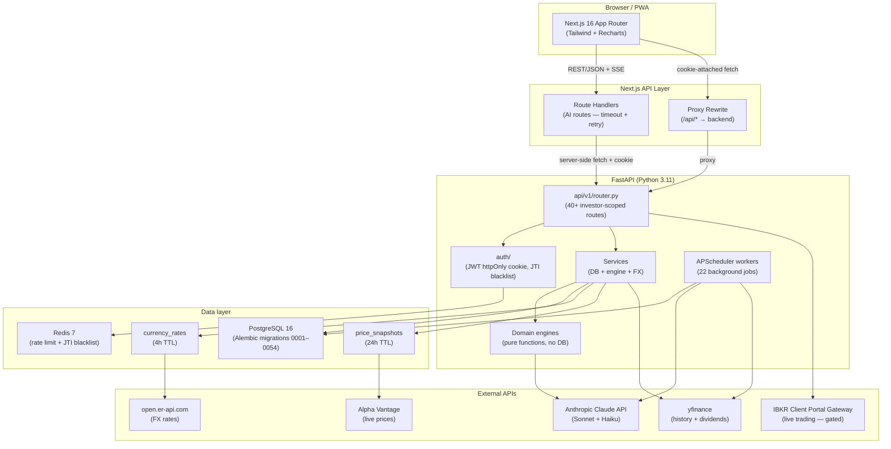

# TradeOps AI — Architecture

**Version:** 3.38.0  
**Last updated:** 2026-06-04

---

## System overview

TradeOps AI is a personal financial intelligence platform. It is not a trading bot. It helps users understand their financial position, model risk, select validated strategies, and simulate outcomes before committing real capital.

```
Browser (Next.js 16)
      │  REST/JSON + SSE
      │  HttpOnly cookie (tradeops_token)
      ▼
FastAPI (Python 3.11)  ←→  Claude API (AI features)
      │  SQLAlchemy ORM       │
      ▼                       │  redis-py
PostgreSQL 16            Redis 7
                         ├── login rate limiting (sorted-set sliding window)
                         └── JWT JTI blacklist (SET + TTL)
```

All services run as Docker containers orchestrated by Docker Compose (local) or Helm/Kubernetes (production).  
CI (GitHub Actions) runs backend tests and builds both Docker images on every push to `main`.

### System architecture diagram



### Next.js proxy

`next.config.mjs` defines a fallback rewrite: all `/api/*` requests not handled by a Next.js Route Handler are proxied to the backend (`NEXT_PUBLIC_API_URL`). This means:
- The browser always calls the frontend origin — no cross-origin cookie issues.
- HttpOnly cookies set by the backend are visible to the browser under the frontend domain.
- Four dedicated Next.js Route Handlers exist for long-running AI requests (agent, ai-report, market-research, recommendations) to handle timeouts and retry logic; all other API calls fall through to the proxy.

---

## Backend modules

```
backend/app/
├── main.py                     # FastAPI app factory, CORS, lifespan, telemetry setup
├── core/config.py              # Settings from environment variables
├── core/tracing.py             # Langfuse AI observability wrapper (trace_ai_call)
├── core/telemetry.py           # OpenTelemetry + Prometheus instrumentation
├── core/cache.py               # Redis cache helper (v3.33.0): get/set/delete/invalidate_investor; graceful degradation; TTL 900s (DI/BA/CAL) / 1800s (reflection); invalidated on order create/execute/cancel
├── db/
│   ├── base.py                 # SQLAlchemy declarative base
│   └── session.py              # DB session dependency
├── models/                     # SQLAlchemy ORM models (one file per entity)
├── schemas/                    # Pydantic request/response schemas
│
├── investor_profiles/          # Personal investor data, experience, minor flag
├── financial_profiles/         # Income, expenses, savings, debts, assets, liabilities
├── family_profiles/            # Household view, family members, shared goals
├── goals/                      # Financial goals with targets, dates, progress
│
├── financial_scoring/          # Deterministic stability score engine
├── risk_modeling/              # Percentage-based risk allocation model
│
├── strategy_library/           # Curated strategy templates (seeded via migration)
├── strategy_selection/         # AI-assisted ranking by investor suitability
│
├── backtesting/
│   ├── engine.py               # Deterministic simulation engine (seeded RNG)
│   ├── service.py
│   └── router.py
│
├── paper_trading/
│   ├── engine.py               # Monthly tick simulation (strategy-template mode)
│   ├── service.py              # place_order (WACC), reprice_positions (live FX-aware repricing)
│   └── router.py               # POST /orders, DELETE /{id}, POST /{id}/reprice
│
├── ai_analysis/
│   ├── analyzer.py             # Claude API integration
│   ├── service.py              # Data aggregation for report context
│   └── router.py
│
├── financial_decision/
│   ├── engine.py               # Pure deterministic decision function (no DB)
│   ├── service.py              # Data aggregation + engine call
│   ├── schemas.py              # InvestmentDecision output model
│   └── router.py               # GET /investors/{id}/decision
│
├── holdings/
│   ├── service.py              # Account + holding CRUD
│   └── router.py               # /investors/{id}/accounts + /holdings
│
├── currency_engine/
│   ├── rates.py                # FX rate fetch (open.er-api.com) + 4h DB cache
│   └── history.py              # Daily FX history: get_rate_at_date(), _fetch_and_store_pair() via yfinance, sync_yesterday(), backfill_all_pairs()
│
├── fx_impact/
│   ├── engine.py               # P&L decomposition: asset P&L vs currency P&L per holding
│   ├── schemas.py              # HoldingFxImpactOut, FxImpactResultOut
│   └── router.py               # GET /investors/{id}/fx-impact
│
├── market_data/
│   ├── fetcher.py              # Alpha Vantage GLOBAL_QUOTE HTTP call
│   ├── service.py              # get_cached_price / fetch_and_cache / refresh_tickers with 24h TTL
│   ├── router.py               # GET /market/quote/{ticker}
│   │                           # GET /market/stream?tickers=...&interval=30 (SSE, TASK 90)
│
├── portfolio_analysis/
│   ├── engine.py               # Pure analysis function (P&L, allocation, exposure, after-tax P&L, FX rates)
│   ├── rebalance_engine.py     # Pure rebalance function (asset tier vs risk model target)
│   ├── service.py              # Data assembly + engine call
│   ├── schemas.py              # PortfolioSummary (+ pnl_after_tax, fx_rates), AccountAnalysis, HoldingAnalysis
│   ├── rebalance_schemas.py    # RebalanceTier, RebalanceResult
│   └── router.py               # GET /investors/{id}/portfolio + /rebalance
│
├── goals_analysis/
│   ├── engine.py               # Pure analysis: progress, contribution needed, gap, on_track
│   ├── service.py              # Data assembly + engine call
│   ├── schemas.py              # GoalAnalysis, GoalsAnalysisResult
│   └── router.py               # GET /investors/{id}/goals-analysis
│
├── market_scanner/
│   ├── catalog.py              # Curated 25-instrument catalog (ETFs, stocks, crypto)
│   ├── engine.py               # Pure filter + rank function (no DB)
│   ├── service.py              # Data assembly + engine call
│   ├── schemas.py              # InstrumentSuggestion, MarketScanResult
│   └── router.py               # GET /investors/{id}/market-scan
│
├── investment_recommendations/
│   ├── analyzer.py             # Claude API call — personalised recommendations from catalog
│   ├── service.py              # Data assembly + engine call
│   ├── schemas.py              # InstrumentRecommendation, PortfolioAction, RecommendationReport
│   └── router.py               # GET /investors/{id}/recommendations
│
├── market_research/            # Deep fundamental analysis + AI investment brief (TASK 57)
│   ├── screener.py             # 63-instrument universe, scoring
│   ├── analyzer.py             # Claude Sonnet AI thesis generation
│   ├── service.py              # Cache + orchestration + DB persistence
│   └── router.py               # GET /market-research, GET /market-research/history, GET /market-research/{id}
│
├── broker_sync/                # Multi-broker import + scheduled auto-sync (TASK 53-56)
│   ├── parsers/                # IBKR Flex XML, eToro CSV, Altshuler Shaham, ALTrade
│   ├── ibkr_rest.py            # IBKR Client Portal Gateway REST sync (TASK 88)
│   ├── service.py              # Upsert logic (match by ISIN → ticker → name)
│   └── router.py               # POST /investors/{id}/accounts/{id}/broker-sync
│
├── pdf_import/                 # AI-powered PDF statement parsing (TASK 86)
│   ├── extractor.py            # pypdf text extraction + Claude Haiku parsing
│   └── router.py               # POST /investors/{id}/pdf-import/parse|import
│
├── crypto_staking/             # Staking APY tracking as income (TASK 87)
│   ├── service.py              # build_staking_report, enable/disable staking
│   └── router.py               # GET/POST/DELETE /investors/{id}/crypto-staking
│
├── services/                   # Cross-cutting shared services (no router)
│   ├── behavioral_indicator.py # Behavioral Confidence Indicator (v3.30.0): κ score (0-1) advisory; compute_behavioral_metrics() + evaluate_behavioral_confidence(); inputs: DQS, documentation alpha, override ratio, has_thesis, historical_asset_edge; never modifies order sizing
│   ├── correlation_engine.py   # Portfolio Anti-Correlation Engine (v3.31.0)
│   └── thesis_drift.py         # Thesis Expiry Monitor (v3.32.0): get_thesis_alerts() checks stop-loss/take-profit/horizon breach on executed buy orders with thesis_params; called by morning brief router: Pearson r between staged ticker and top 5 holdings; compute_portfolio_correlation() → diversification dict embedded in pre_flight_review; MIN_HISTORICAL_DAYS=15; buy-only, ticker-required; deduplicates price_snapshots to one per calendar day
│
├── staged_orders/              # Staged Allocations & Order Builder (v3.13.0)
│   ├── schemas.py              # StagedOrderCreate/Out/List, PreFlightReview (+ behavioral: BehavioralIndicator), BehavioralIndicator, ProjectedMetrics, GenerateRebalanceResult, OrderTemplateOut, OutcomeComparisonOut, CalibrationOut
│   ├── service.py              # create/list/execute/cancel, pre-flight review (now includes behavioral indicator), tax analysis, minimum-trade rebalancing, outcome comparisons, calibration
│   ├── smart_suggest.py        # AI Smart Allocation Assistant; DQS + behavioral patterns injected into context (v3.29.0)
│   ├── templates.py            # save/apply/delete named order templates (v3.14.0)
│   └── router.py               # GET/POST /staged-orders, POST /generate-rebalance, POST /{id}/execute, DELETE /{id}, GET/POST/DELETE /templates, POST /templates/{id}/apply, GET /outcomes, GET /calibration
│
├── action_feed/                # Daily action feed — morning briefing (TASK 84)
│   ├── engine.py               # Aggregates 5 signal sources; priority 1/2/3; dedup; cap 12
│   ├── schemas.py              # ActionItem, DailyActionFeed
│   └── router.py               # GET /investors/{id}/action-feed
│
├── pairs_trading/              # Statistical arbitrage (TASK 85)
│   ├── engine.py               # OLS hedge ratio, ADF(0) cointegration, Z-score signals
│   ├── schemas.py              # PairAnalysis, PairSignalSave, PairSignalOut
│   └── router.py               # GET /analyze, POST /signals
│
├── market_signals/             # Daily news sentiment + whale mention monitor (Phase 11)
│   └── router.py               # GET /investors/{id}/market-signals
│
├── net_worth/                  # Net worth dashboard: portfolio + assets − liabilities, FI projection
│   ├── service.py              # get_summary, get_history, save_snapshot; FI projection (binary search, 4% SWR)
│   └── router.py               # GET /investors/{id}/net-worth, GET /investors/{id}/net-worth/history
│
├── tax_summary/                # Tax year summary: realized gains/losses, WACC cost basis, est. 25% tax
│   ├── service.py              # WACC per-ticker cost tracking, long/short-term classification
│   └── router.py               # GET /investors/{id}/tax-summary?year=YYYY
│
├── coach/                      # AI Coach: persistent proactive insights with dedup and dismiss
│   ├── service.py              # 7 rule functions + AI enrichment + dedup_key suppression
│   └── router.py               # GET /investors/{id}/coach, POST /coach/refresh, DELETE /coach/{id}
│
├── provenance/                 # Decision provenance recording and replay (v1.2.0–v1.4.0)
│   ├── recorder.py             # record_decision() fire-and-forget; snapshot_risk_model/holdings/signals helpers
│   ├── schemas.py              # DecisionListItem, DecisionDetail, ReplayResult
│   └── router.py               # GET /investors/{id}/decisions, GET /decisions/{id}, POST /decisions/{id}/replay
│
├── strategy_drift/             # Strategy drift detection: actual vs risk model targets (v1.5.0)
│   ├── service.py              # compute_drift() — RMSE-based alignment score 0–100 per tier
│   ├── schemas.py              # StrategyDriftReport, DriftItem
│   └── router.py               # GET /investors/{id}/strategy-drift
│
├── decision_timeline/          # Unified chronological event timeline with causal notes (v1.6.0)
│   ├── service.py              # Merges RecommendationDecision + HoldingTransaction; causal portfolio delta
│   ├── schemas.py              # TimelineEvent, TimelinePage
│   └── router.py               # GET /investors/{id}/timeline?days=30&limit=50
│
├── behavioral_patterns/        # 12-month behavioral analysis: holding periods, patterns, score (v1.7.0)
│   ├── service.py              # FIFO buy/sell matching; recommendation follow-through; behavioral score
│   ├── schemas.py              # BehavioralMetrics, HoldingPeriodStats, BehavioralPattern
│   └── router.py               # GET /investors/{id}/behavioral-patterns
│
├── attribution/                # Performance attribution + multi-dim confidence scoring (v2.0.0)
│   ├── service.py              # Breaks value change into capital deployed / market return / fees drag
│   ├── schemas.py              # PerformanceAttribution, AttributionFactor, ConfidenceLayer
│   └── router.py               # GET /investors/{id}/attribution?period=ytd|1y|6m|3m
│
├── investor_maturity/          # Investor maturity engine — 4-stage scoring (v2.1.0)
│   ├── service.py              # 8 weighted components → composite 0-100 score → Foundation/Discipline/Optimization/Advanced Cognition
│   ├── schemas.py              # MaturitySnapshot, ComponentScores, STAGE_LABELS, FEATURES_BY_STAGE
│   └── router.py               # GET /investors/{id}/maturity, GET /maturity/history, POST /maturity/refresh
│
├── financial_twin/             # Financial Twin + Health Radar — daily snapshot engines (v2.2.0)
│   ├── service.py              # compute_twin_and_health(): 8 twin dims + 9 health dims co-computed in one call
│   ├── schemas.py              # TwinSnapshot, TwinDimensions, HealthRadarSnapshot, HealthRadarDimensions
│   └── router.py               # GET /twin, GET /twin/history, POST /twin/refresh; GET /health-radar
│
├── behavioral_risk/            # Behavioral risk detection — 7 deterministic rules (v2.3.0)
│   ├── service.py              # detect_and_persist(): panic_selling, revenge_trading, overtrading_spike, performance_chasing, concentration_addiction, risk_creep, strategy_abandonment
│   ├── schemas.py              # BehavioralRiskEventResponse, BehavioralRiskListResponse, EVENT_TYPE_LABELS
│   └── router.py               # GET /behavioral-risk, GET /{id}, POST /{id}/resolve, POST /detect
│
├── simulation/                 # Financial Futures + Counterfactual Replay engine (v2.5.0–v2.6.0)
│   ├── engine.py               # Pure-math scenarios: run_debt_payoff, run_savings_increase, run_job_loss, run_market_crash, run_monte_carlo_growth; seeded RNG for reproducibility
│   ├── counterfactuals.py      # Backward-looking replay: run_counterfactual_rebalance, run_counterfactual_constraint, run_counterfactual_hold; tier-weighted reference rates; dual-path results
│   ├── service.py              # create_simulation(): loads data_snapshot, dispatches engine or counterfactual, persists result; list/get/save CRUD
│   ├── schemas.py              # SimulationRunCreate, SimulationParameters (incl. decision_id, event_id), SimulationRunResponse, SimulationListResponse
│   └── router.py               # POST /simulations, GET /simulations, GET /simulations/{id}, POST /simulations/{id}/save; ValueError → 422
│
├── pension_simulation/         # Standalone pension projector
├── debt_planner/               # Debt payoff planner (avalanche/snowball)
├── watchlist/                  # Per-investor ticker watchlist
├── notifications/              # In-app notification store
├── investment_agent/           # Maturity-aware AI Thought Partner (v2.7.0–v3.1.0)
│   ├── engine.py               # run_agent(verbosity): stage-adaptive prompt, maturity+twin+behavioral context injection; past_summaries (v3.1.0) from ai_memory_entries injected for longitudinal narrative
│   ├── schemas.py              # AgentReport (incl. maturity_stage, verbosity_used), ActionItem, Opportunity, CapitalThresholdPlan
│   └── router.py               # GET /agent?verbosity=beginner|standard|advanced
├── household/                  # Partner/Household View (v3.2.0)
│   ├── service.py              # create_household, join_household, leave_household, get_summary, get_aggregate_metrics
│   ├── schemas.py              # HouseholdCreate, HouseholdOut, HouseholdMemberCard, HouseholdSummary, HouseholdAggregateMetrics
│   └── router.py               # POST /create, POST /join/{id}, DELETE, GET, GET /aggregate
├── command_center/             # Financial Command Center — daily intelligence hub (v2.8.0–v3.1.0)
│   ├── schemas.py              # CommandCenterReport, FinancialStatusHeader, PrioritizedAction, EvolutionItem, HealthRadarPoint, TwinInsightsData, BehavioralRiskCard, FuturesPreview, ReplayHighlight, InvestorProgression, GoalProgressItem (v2.9.0)
│   ├── action_engine.py        # Deterministic ActionPrioritizer: 5 rule categories (EF, behavioral, concentration, contribution, goals); top-3 by composite score; stage-adaptive copy
│   ├── ai_cache.py             # Redis AI summary cache (v3.0.0): get/set/invalidate; key cc_ai:{id}:{verbosity}; 26h TTL; no-op fallback when Redis absent
│   ├── ai_memory.py            # Longitudinal AI memory (v3.1.0): write_entry() / get_recent(months=3); stores portfolio_assessment + key_metrics JSONB; rolling 3-month window
│   ├── evolution.py            # EvolutionFeedGenerator: 7-day delta across twin + maturity + behavioral events; negatives first; cap 8
│   ├── replay_selector.py      # CounterfactualSelector: highest abs(delta) from completed counterfactual runs
│   ├── orchestrator.py         # build(): ThreadPoolExecutor(7) parallel fetch + Redis cache check + serial AI fallback → CommandCenterReport; writes ai_memory_entry after live AI call (v3.1.0)
│   └── router.py               # GET /investors/{id}/command-center?verbosity=beginner|standard|advanced
├── transactions/               # Immutable holding transaction log
├── price_alerts/               # User-defined price triggers
├── economic_calendar/          # Earnings dates for held + watched tickers
├── portfolio_correlation/      # 90-day Pearson correlation matrix
├── holdings_news/              # Latest news articles per held ticker
├── reports/                    # PDF report export (monthly/quarterly)
├── retirement_readiness/       # 0–100 readiness score: pension via makdam + hishtalmut/portfolio via 4% SWR
├── portfolio_chat/             # Natural language Q&A with 5-turn context
├── family_portfolio/           # Household consolidated view
├── liquidity_runway/           # Tiered liquidation model
├── resilience/                 # Life-event survival simulator
│
├── auth/
│   ├── service.py              # JWT creation/decoding, bcrypt password hashing
│   ├── dependencies.py         # get_current_user FastAPI dependency (cookie + Bearer)
│   ├── investor_access.py      # verify_investor_access — ownership enforcement
│   ├── blacklist.py            # JTI blacklist: Redis primary, in-memory fallback
│   ├── rate_limiter.py         # Login rate limiter: Redis sorted-set sliding window
│   ├── router.py               # POST /auth/login|register|logout  GET /auth/me
│   └── schemas.py              # UserCreate, UserLogin, UserOut, Token
│
├── live_trading/
│   ├── ibkr.py                 # IBKR Client Portal Gateway HTTP client (market + limit orders)
│   ├── engine.py               # 5-gate readiness check + order risk validation
│   ├── service.py              # submit_order, cancel_order, kill_switch
│   ├── schemas.py              # OrderRequest, AcknowledgeRiskRequest (gateway_url SSRF-validated)
│   └── router.py               # /investors/{id}/live-trading — gated by all 5 safety checks
│
├── audit/                      # Event log for all significant actions
├── dashboard/                  # Aggregated summary endpoint
├── admin/                      # Multi-tenant admin panel + AI cost tracking + live trading queue
└── workers/                    # APScheduler background jobs
    ├── scheduler.py            # Job registry + start/stop
    └── jobs/
        ├── market_signals_job.py         # 20:15 UTC daily — sentiment per holding
        ├── broker_auto_sync.py           # 09:00 UTC daily — auto-sync enabled accounts
        ├── weekly_digest.py              # 08:00 UTC Monday — AI portfolio email digest (v3.0.0: moved from Friday 18:00)
        ├── research_prewarm.py           # Scheduled market research refresh
        ├── fx_history_sync.py            # 21:30 UTC daily — yesterday's FX rates for all active currency pairs
        ├── command_center_nightly.py     # 05:00 UTC daily — pre-compute AI summaries for all investors → Redis (v3.0.0)
        └── command_center_checkpoint.py  # 04:00 UTC Monday — weekly checkpoint anchors → command_center_checkpoints table (v3.0.0)
```

### API routing

All routes are under `/api/v1/`. Assembled in `app/api/v1/router.py`.

**Auth routes** (public — no ownership check required):

| Prefix | Module | Notes |
|--------|--------|-------|
| `/auth/register` | auth | `POST` — create account, bcrypt-hashed |
| `/auth/login` | auth | `POST` — sets HttpOnly `tradeops_token` cookie (7-day JWT with JTI) |
| `/auth/logout` | auth | `POST` — blacklists JTI in Redis, clears cookie |
| `/auth/me` | auth | `GET` — returns current user from token |

**Investor-scoped routes** — all require `verify_investor_access` (JWT valid + investor owned by caller):

| Prefix | Module | Tags |
|--------|--------|------|
| `/investors` | investor_profiles, financial_profiles, dashboard, audit | investors, financial-profiles, dashboard, audit |
| `/investors/{id}/goals` | goals | goals |
| `/investors/{id}/risk-model` | risk_modeling | risk-model |
| `/investors/{id}/strategies` | strategy_selection | strategies |
| `/investors/{id}/backtests` | backtesting | backtesting |
| `/investors/{id}/paper-portfolios` | paper_trading | paper-trading |
| `/investors/{id}/ai-report` | ai_analysis | ai-analysis |
| `/investors/{id}/decision` | financial_decision | decision |
| `/investors/{id}/goals-analysis` | goals_analysis | goals-analysis |
| `/investors/{id}/portfolio` | portfolio_analysis | portfolio |
| `/investors/{id}/portfolio/rebalance` | portfolio_analysis | portfolio |
| `/investors/{id}/portfolio/refresh-prices` | portfolio_analysis | portfolio |
| `/investors/{id}/portfolio/history` | portfolio_analysis | portfolio |
| `/investors/{id}/market-scan` | market_scanner | market-scan |
| `/investors/{id}/recommendations` | investment_recommendations | recommendations |
| `/investors/{id}/market-research` | market_research | market-research |
| `/investors/{id}/accounts/{id}/broker-sync` | broker_sync | broker-sync |
| `/investors/{id}/accounts/{id}/broker-sync/ibkr-rest` | broker_sync | broker-sync |
| `/investors/{id}/pdf-import` | pdf_import | pdf-import |
| `/investors/{id}/crypto-staking` | crypto_staking | crypto-staking |
| `/investors/{id}/action-feed` | action_feed | action-feed |
| `/investors/{id}/staged-orders` | staged_orders | staged-orders |
| `/investors/{id}/pairs-trading` | pairs_trading | pairs-trading |
| `/investors/{id}/market-signals` | market_signals | market-signals |
| `/investors/{id}/pension-simulation` | pension_simulation | pension-simulation |
| `/investors/{id}/debt-planner` | debt_planner | debt-planner |
| `/investors/{id}/watchlist` | watchlist | watchlist |
| `/investors/{id}/notifications` | notifications | notifications |
| `/investors/{id}/agent` | investment_agent | investment-agent |
| `/investors/{id}/command-center` | command_center | command-center |
| `/investors/{id}/transactions` | transactions | transactions |
| `/investors/{id}/alerts` | price_alerts | price-alerts |
| `/investors/{id}/calendar` | economic_calendar | economic-calendar |
| `/investors/{id}/portfolio/correlation` | portfolio_correlation | portfolio-correlation |
| `/investors/{id}/news` | holdings_news | holdings-news |
| `/investors/{id}/reports` | reports | reports |
| `/investors/{id}/retirement-readiness` | retirement_readiness | retirement-readiness |
| `/investors/{id}/chat` | portfolio_chat | chat |
| `/investors/{id}/family-portfolio` | family_portfolio | family-portfolio |
| `/investors/{id}/portfolio/liquidity-runway` | liquidity_runway | liquidity-runway |
| `/investors/{id}/portfolio/resilience` | resilience | resilience |
| `/investors/{id}/live-trading` | live_trading | live-trading |
| `/investors/{id}/fx-impact` | fx_impact | fx-impact |
| `/investors/{id}/net-worth` | net_worth | net-worth |
| `/investors/{id}/tax-summary` | tax_summary | tax-summary |
| `/investors/{id}/coach` | coach | coach |
| `/investors/{id}/decisions` | provenance | provenance |
| `/investors/{id}/strategy-drift` | strategy_drift | strategy-drift |
| `/investors/{id}/timeline` | decision_timeline | timeline |
| `/investors/{id}/behavioral-patterns` | behavioral_patterns | behavioral-patterns |
| `/investors/{id}/attribution` | attribution | attribution |
| `/investors/{id}/maturity` | investor_maturity | maturity |
| `/market` | market_data | market-data (REST + SSE) |
| `/investors/{id}/accounts` | holdings | holdings |
| `/investors/{id}/accounts/{id}/holdings` | holdings | holdings |
| `/family-profiles` | family_profiles | family-profiles |
| `/strategies/templates` | strategy_library | strategy-templates |
| `/admin` | admin | admin |

**Dependency groups used in `router.py`:**
```python
_own = [Depends(verify_investor_access)]          # JWT + ownership check
_ai  = [Depends(verify_investor_access),           # JWT + ownership + monthly budget guard
        Depends(require_ai_budget)]
```
AI-gated routes (`_ai`): `ai-report`, `agent`, `market-scan`, `recommendations`, `market-research`, `chat`.
Replay endpoint (`POST /decisions/{id}/replay`) is `_own` (not `_ai`) — the AI budget check is handled inside the endpoint after validating the decision exists.

Interactive docs: `http://localhost:8000/docs`

---

## Database schema

Managed by Alembic. Migrations in `backend/alembic/versions/`.

| Migration | Description |
|-----------|-------------|
| `0001` | Core tables (investor_profiles, financial_*, family_*, goals, risk_models) |
| `0002` | Strategy templates + seed data (6 templates) |
| `0003` | Backtest tables (backtest_runs, backtest_periods) |
| `0004` | Paper trading tables (paper_portfolios, paper_ticks) |
| `0005` | investor_profiles extended (investment_goal, risk_tolerance, time_horizon, preferred_assets) |
| `0006` | risk_models enforcement fields (age_tier, allowed/blocked families, live_trading_allowed, max_trade_size_pct) |
| `0007` | Holdings tables (investment_accounts, investment_holdings) |
| `0008` | currency_rates cache table |
| `0009` | price_snapshots market data cache |
| `0010` | portfolio_snapshots value history |
| `0011` | goal tracking modes (target_amount_mode, linked_account_id) |
| `0012` | pension_fund fields (monthly_contribution, monthly_contribution_employee/employer, fund_status, annual_return_rate) |
| `0013` | study_fund fields (total_deposits, current_balance, purchase_date) |
| `0014` | vehicle asset_type |
| `0015` | price_alerts email field |
| `0016` | widen nationality columns |
| `0017` | watchlist_items table |
| `0018` | family financial model (financial_goals family FK, family_members) |
| `0019` | holding_transactions table |
| `0020` | price_alerts table |
| `0021` | emergency_fund flag on financial_profiles |
| `0022` | is_emergency_fund flag on investment_holdings |
| `0023` | goal linked_account_id FK |
| `0024` | users table + JWT auth |
| `0025` | account auto-sync fields (auto_sync_enabled, last_synced_at) |
| `0026` | holding management fees (management_fee_balance_pct, management_fee_contribution_pct) |
| `0027` | options holdings (strike_price, expiry_date, option_type, underlying_ticker, contract_multiplier, position_type) |
| `0028` | investor weekly digest flag |
| `0029` | holding purchase_fx_rate |
| `0030` | market_signals table (NEWS_SENTIMENT, WHALE_MENTION, PAIRS_ZSCORE; composite_score 0–100) |
| `0031` | investment_holdings makdam column (Israeli pension coefficient) |
| `0032` | ai_usage_logs table (token counts, cost_usd per Claude API call) |
| `0033` | family multi-user invite fields; investment_accounts owner_type; holding balance_updated_at |
| `0034` | CHECK constraints on enum-like VARCHAR columns (owner_type, invite_status, asset_type, etc.) |
| `0035` | live_trading_sessions table (gateway_url, session_token, status, order log) |
| `0036` | audit_events index on investor_profile_id; CHECK constraints on investable_capital_pct, max_trade_size_pct |
| `0037` | fx_rate_history table (from_currency, to_currency, date, rate, source) — daily FX rate store |
| `0038` | paper_trading_v2: cash_balance + new paper_positions + paper_orders tables |
| `0039` | market_research_reports table (JSONB persistence) |
| `0040` | net_worth_snapshots + coach_insights tables |
| `0041` | recommendation_decisions table (decision provenance: frozen inputs JSONB, AI metadata, output summary, decision hash) |
| `0042` | investor_maturity_snapshots table (composite score, stage, component_scores JSONB, features_unlocked JSONB, notes JSONB) |
| `0043` | financial_twin_snapshots table (8 twin dimensions, overall_score, emotional_risk) |
| `0044` | behavioral_risk_events table (event_type, severity, status, description, recommendation, detected_at, resolved_at) |
| `0045` | simulation_runs table (scenario_type, parameters JSONB, results JSONB, status, computed_at) |
| `0046` | command_center_checkpoints table (investor_id, checkpoint_at, twin_score, maturity_score, active_risks, notes JSONB) |
| `0047` | ai_memory_entries table (investor_id, summary_at, verbosity, portfolio_assessment TEXT, key_metrics JSONB) — longitudinal AI memory (v3.1.0) |
| `0048` | households table + investor_profiles.household_id FK (nullable, SET NULL on delete) — Partner/Household View (v3.2.0) |
| `0049` | advisor_share_tokens table — shareable read-only advisor report links (v3.7.0) |
| `0050` | staged_orders table (investor_id, ticker, name, action, quantity, unit_price, currency, estimated_value, asset_type, status, goal_id, pre_flight_review JSONB, projected_metrics JSONB, tax_note, executed_at, actual_outcome JSONB) — Staged Allocations & Order Builder (v3.13.0) |

### Core tables

```
investor_profiles          — personal data, currency, experience, minor flag; + investment_goal, risk_tolerance, time_horizon, preferred_assets, trading_frequency, guardian_required
financial_profiles         — income/expenses/savings/debts per investor
financial_assets           — individual assets linked to financial_profile
financial_liabilities      — individual liabilities linked to financial_profile
financial_goals            — goals with target amounts and dates
family_profiles            — household profiles
family_members             — members linked to family_profile

risk_models                — generated risk allocation models per investor; + enforcement fields (age_tier, allowed/blocked strategy families, live_trading_allowed, etc.)

investment_accounts        — investor's accounts by provider + type (pension, brokerage, crypto, etc.)
investment_holdings        — individual positions per account (ticker, ISIN, quantity, avg buy price, current value)
currency_rates             — FX rate cache (base → target, fetched_at); 24h TTL
price_snapshots            — market price cache per ticker (Alpha Vantage); 24h TTL
portfolio_snapshots        — historical portfolio value snapshots (saved on every price refresh)

strategy_templates         — curated strategy definitions (seeded)
strategy_recommendations   — ranked strategies generated for an investor

backtest_runs              — backtest execution records
backtest_periods           — monthly portfolio value snapshots per run

paper_portfolios           — paper trading portfolios
paper_ticks                — monthly simulation ticks per portfolio

audit_events               — all significant system actions
recommendation_decisions   — decision provenance: frozen inputs at decision time (risk model, holdings, signals), AI metadata (model, tokens, summaries), output summary, SHA-256 decision hash
```

---

## Frontend structure

Next.js 14 with App Router, Tailwind CSS, Recharts.

```
frontend/src/
├── app/
│   ├── (auth)/
│   │   └── login/page.tsx          # Login + investor profile creation
│   ├── (dashboard)/
│   │   ├── layout.tsx              # Sidebar navigation shell (mobile hamburger + desktop fixed)
│   │   ├── dashboard/page.tsx      # Dashboard: stat cards, Daily Action Feed, portfolio widget
│   │   ├── investments/page.tsx    # Accounts, holdings, SSE live prices, broker import
│   │   ├── performance/page.tsx    # TWR, MWR, attribution, alpha, complexity premium
│   │   ├── stress-test/page.tsx    # Historical scenarios, Monte Carlo, resilience simulator
│   │   ├── transactions/page.tsx   # Holding transaction log
│   │   ├── watchlist/page.tsx      # Ticker watchlist
│   │   ├── debt-planner/page.tsx   # Debt payoff planner
│   │   ├── financial/page.tsx      # Financial profile CRUD + assets/liabilities
│   │   ├── goals/page.tsx          # Financial goals
│   │   ├── family/page.tsx         # Family profile + household portfolio
│   │   ├── profile/page.tsx        # Investor profile view + edit
│   │   ├── risk/page.tsx           # Risk model view and generation
│   │   ├── strategies/page.tsx     # Strategy recommendations
│   │   ├── backtesting/page.tsx    # Run and view backtests
│   │   ├── paper-trading/page.tsx  # Paper portfolio tick simulation
│   │   ├── market-scan/page.tsx    # Market scanner
│   │   ├── pairs-trading/page.tsx  # Pairs trading: Z-score gauge, cointegration (TASK 85)
│   │   ├── pdf-import/page.tsx     # PDF statement import (TASK 86)
│   │   ├── crypto-staking/page.tsx # Crypto staking rewards + APY (TASK 87)
│   │   ├── market-research/page.tsx # Deep market research + 3-tier picks
│   │   ├── ai-agent/page.tsx       # Free-form AI financial assistant
│   │   ├── recommendations/page.tsx # Tailored recommendations
│   │   ├── audit/page.tsx          # Audit event log
│   │   ├── admin/page.tsx          # Admin panel: users, profiles, AI cost, live trading queue (admin role required)
│   │   ├── fx-impact/page.tsx      # FX Impact: asset P&L vs currency P&L breakdown
│   │   ├── net-worth/page.tsx      # Net Worth dashboard: balance sheet, 12-month trend, FI projection
│   │   ├── tax-summary/page.tsx    # Tax Year Summary: realized gains/losses, WACC cost basis, est. tax
│   │   ├── insights/page.tsx       # AI Coach: proactive insights with severity grouping + dismiss
│   │   ├── decisions/page.tsx      # Decision Provenance: list + detail panel + replay (v1.3.0–v1.4.0)
│   │   ├── strategy-drift/page.tsx # Strategy Drift: alignment gauge + per-tier drift bars (v1.5.0)
│   │   ├── timeline/page.tsx       # Financial Decision Timeline: score sparklines, AI assessment cards, month grouping, behavioral events (v3.9.0 rewrite)
│   │   ├── onboarding/page.tsx     # 4-step guided setup wizard with step completion detection (v3.10.0)
│   │   ├── behavioral/page.tsx     # Behavioral Intelligence: score ring, holding periods, patterns (v1.7.0)
│   │   ├── attribution/page.tsx    # Performance Attribution: factor bars + confidence breakdown (v2.0.0)
│   │   ├── maturity/page.tsx       # Investor Maturity: score arc, stage roadmap, component bars (v2.1.0)
│   │   ├── twin/page.tsx           # Financial Twin: 8-sided SVG radar + dimension cards + trend arrows (v2.2.0)
│   │   ├── health-radar/page.tsx   # Financial Health Radar: 9-sided SVG radar + score bar breakdown (v2.2.0)
│   │   ├── behavioral-risk/page.tsx # Behavioral Risk: event cards, severity badges, resolve action, scan trigger (v2.3.0)
│   │   ├── futures/page.tsx        # Financial Futures: scenario builder, SVG trajectory chart, p10/p50/p90 bands, save/history (v2.5.0)
│   │   ├── command-center/page.tsx # Financial Command Center: status header, prioritized actions, evolution feed, goal progress, health radar, twin insights, behavioral risks, futures preview, replay highlight, AI Thought Partner, investor progression (v2.8.0–v2.9.0)
│   │   └── settings/page.tsx       # Account and platform info
│   └── page.tsx                    # Root redirect → /dashboard
├── components/ui/                  # Shared UI primitives (Card, Badge, Button, etc.)
├── hooks/
│   ├── useInvestorId.ts            # Reads investor ID from localStorage, redirects if absent
│   └── useMaturityVariant.ts       # Maps maturity stage → MaturityVariant config (showNumericMetrics, showFuturesPreview, showReplayHighlight, showDragFactors, aiVerbosity, etc.)
├── components/command-center/      # Command Center section components
│   ├── StatusHeader.tsx            # Twin score + delta + maturity stage + trend pills
│   ├── ActionsPanel.tsx            # Top-3 priority action cards
│   ├── EvolutionFeed.tsx           # 7-day financial delta feed
│   ├── GoalProgressPanel.tsx       # Top-2 goals with progress bars + status badges (v2.9.0)
│   ├── HealthRadarCard.tsx         # 9-axis recharts RadarChart
│   ├── TwinInsightsCard.tsx        # Positive drivers + drag factors bars
│   ├── BehavioralRisksPanel.tsx    # Active risk event cards
│   ├── FuturesPreviewCard.tsx      # 3-path simplified trajectory chart
│   ├── ReplayHighlightCard.tsx     # Best counterfactual one-liner
│   ├── AIThoughtPartnerCard.tsx    # AI summary + verbosity toggle + collapsible context panel (twin delta, behavioral risks, evolution chips) (v3.10.0)
│   └── ProgressionCard.tsx         # Stage roadmap + unlocked features
├── components/layout/              # Layout shell components
│   ├── sidebar.tsx                 # Sidebar nav + mobile drawer + theme toggle + mobile notification bell
│   ├── NotificationBell.tsx        # Bell icon + badge count + dismissable dropdown panel (v3.11.0)
│   ├── NextBestActionBar.tsx       # Persistent contextual action strip — highest P1/P2 action, cycle/dismiss (v3.12.0)
│   ├── BottomNav.tsx               # Mobile bottom navigation bar
│   └── auth-fetch-patch.ts        # Patches fetch to inject Authorization header
└── lib/
    ├── api.ts                      # Typed API client helpers
    └── utils.ts                    # formatCurrency, formatPercent, cn()
```

### Session management

JWT authentication (HS256, 7-day expiry). Token stored in an HttpOnly `SameSite=Strict` cookie (`tradeops_token`). Every token includes a unique `jti` (JWT ID) claim.

The active investor UUID is stored in `localStorage` under `tradeops_investor_id`. The `useInvestorId` hook reads this and redirects to `/login` if absent. This controls *which profile* is displayed; it does not bypass auth — all API requests still require a valid JWT.

See [Authentication & Authorization](#authentication--authorization) for the full security model.

---

## Authentication & Authorization

### Token lifecycle

1. `POST /auth/login` — verifies bcrypt password, issues a HS256 JWT containing `{"sub": user_id, "exp": +7 days, "jti": uuid4}`. Sets the `tradeops_token` HttpOnly, `SameSite=Strict` cookie with matching `max_age`.
2. Every subsequent request — `get_current_user` dependency extracts the token (cookie preferred, `Authorization: Bearer` fallback), decodes it, checks JTI against the Redis blacklist, and returns the `User` model.
3. `POST /auth/logout` — decodes the token **without** blacklist check, writes `jwt_bl:{jti}` to Redis with TTL = remaining token lifetime, then clears the cookie. The token is now permanently invalid even if an attacker replayed the cookie.

### JTI blacklist

Location: `auth/blacklist.py`

- **Primary store**: Redis — `SET jwt_bl:{jti} 1 EX <remaining_seconds>`. TTL matches the token's remaining lifetime exactly so no manual cleanup is needed.
- **Fallback**: per-process in-memory dict `{jti: expires_at}` — used automatically when Redis is unreachable. Expired entries are pruned on every write.
- **Degraded mode**: during a Redis outage, a JTI revoked in one worker/pod may still pass in another. This is the accepted trade-off; Redis liveness probes keep outages brief.
- **Backward compatibility**: tokens issued before v0.90.0 have no `jti` field. `decode_token()` skips the blacklist check when `jti` is absent — existing sessions remain valid until natural expiry.

### Multi-tenant ownership model

One **user** → many **investor profiles**. Every investor-scoped route carries `{investor_id}` in the path. The `verify_investor_access` dependency (`auth/investor_access.py`) checks:

```python
profile = db.get(InvestorProfile, investor_id)
if not profile or profile.user_id != current_user.id:
    raise HTTPException(404)  # 404 not 403 — avoids leaking existence
```

Admins bypass this check via the admin router's separate `require_admin` dependency.

### Route protection summary

| Scope | Dependency | Applied to |
|-------|-----------|------------|
| Public | None | `/auth/*`, `/market/*` |
| Authenticated | `get_current_user` | `/auth/me`, investor creation |
| Investor-owned | `_own` = `verify_investor_access` | All 35+ `/investors/{id}/...` routes |
| AI-gated | `_ai` = ownership + `require_ai_budget` | ai-report, agent, recommendations, market-research, market-scan, chat |
| Admin-only | `require_admin` | `/admin/*` |

### Password hashing

bcrypt via `bcrypt` library. No migration needed to change hash algorithm for existing users — new hashes are verified by the algorithm stored in the hash prefix.

---

## Financial scoring engine

Location: `backend/app/financial_scoring/engine.py`

Deterministic, no ML. Inputs from the investor's financial profile. Output:

```json
{
  "score": 0–100,
  "classification": "unstable | fragile | stable | strong",
  "risk_modifier": "reduce | neutral | allow_growth",
  "recommendations": ["..."]
}
```

Scoring factors:
- Income-to-expense ratio
- Emergency fund months
- Debt-to-income ratio
- Net worth (assets vs liabilities)
- Job stability
- Income trend
- Dependents count
- Savings rate

The stability score directly constrains the risk allocation model — low stability restricts aggressive strategies regardless of the user's stated risk preference.

---

## Risk allocation model

Location: `backend/app/risk_modeling/`

Percentage-based, not a vague low/medium/high label. Example output:

```json
{
  "investable_capital_pct": 40,
  "low_risk_pct": 25,
  "growth_pct": 10,
  "high_risk_pct": 5,
  "classification": "conservative | moderate | growth | aggressive",
  "stability_score": 72
}
```

The model is recalculated on demand and stored in the `risk_models` table. Each investor may have multiple historical models.

v0.9.0 additions — enforcement fields computed alongside allocation:
- `age_tier` — minor / young_adult / adult / pre_retirement / retirement (derived from DOB)
- `allowed_strategy_families` / `blocked_strategy_families` — JSONB lists
- `live_trading_allowed` — gated on stability score ≥ 50 + intermediate+ experience
- `requires_paper_trading` — true for beginners or low-stability investors
- `max_trade_size_pct`, `max_open_positions` — position-level risk limits

---

## Financial decision engine

Location: `backend/app/financial_decision/`

Stateless, deterministic. Called via `GET /api/v1/investors/{id}/decision`. Not persisted.

Output:

```json
{
  "can_invest": true,
  "readiness_classification": "ready | ready_with_limits | not_ready | education_only",
  "recommended_investment_pct": 35,
  "max_high_risk_pct": 5,
  "blocked_actions": ["live_trading"],
  "required_actions": ["maintain_emergency_fund"],
  "warnings": ["High debt ratio detected"],
  "explanation": "..."
}
```

Decision rules (in priority order):
1. No financial profile → `not_ready`
2. `is_minor` or `age_tier == "minor"` → `education_only`
3. `investment_goal == "education"` → `education_only`
4. `stability_score < 30` or `emergency_fund_months < 1` → `not_ready`
5. `stability_score 30–60` or `debt_to_income > 40%` or `emergency_fund < 3mo` → `ready_with_limits`
6. Otherwise → `ready`

Blocked/required actions sourced from the investor's latest risk model enforcement fields.

---

## Strategy library

Location: `backend/app/strategy_library/`

Six seeded templates (created in migration `0002`):

| Template | Type | Risk Level |
|----------|------|------------|
| Financial Education Mode | education | minimal |
| Build Financial Foundation | savings_first | very_low |
| Capital Preservation | preservation | low |
| Balanced Growth | balanced | moderate |
| Growth Focused | growth | moderate_high |
| Active Trading | active | high |

Strategy selection ranks these by investor suitability using the stability score, risk model, experience level, and goals.

---

## Backtesting engine

Location: `backend/app/backtesting/engine.py`

- Deterministic: seeded RNG ensures reproducibility
- Simulates month-by-month portfolio returns using strategy parameters
- Records a `backtest_periods` snapshot for each month
- Computes: total return, annualised return, max drawdown, Sharpe ratio, win rate

---

## Paper trading engine

Location: `backend/app/paper_trading/`

**Free-form mode (v0.94+, primary):**
- User sets starting virtual cash (any amount, any currency) — no risk model required
- `POST /orders` — buy or sell any ticker; price auto-fetched from live market data cache
- **Currency-safe (v0.99.3 / v2.0.1):** price always FX-converted to portfolio currency before deducting cash — applies to both auto-fetched prices and user-supplied prices (backend resolves asset native currency from cached snapshot); position `currency` stored as portfolio currency
- Buy: validates `cash_balance ≥ total_cost`; updates position using WACC average cost
- Sell: validates position quantity; deletes position row when fully closed
- `portfolio.current_value = cash_balance + Σ(position.qty × avg_cost)`
- `DELETE /{portfolio_id}` — hard delete with cascade to positions + orders + ticks
- `POST /{id}/reprice` — fetches live prices for all positions, FX-converts each to portfolio currency, recomputes `current_value` and `total_return_pct`

**Strategy simulation mode (legacy, optional):**
- Requires a linked strategy template
- Each tick = one simulated calendar month; Gaussian return from strategy type parameters
- `POST /{id}/tick` still available

Portfolio status: `active` | `paused` | `completed`

---

## AI features

Six features call the Anthropic Claude API. All require `ANTHROPIC_API_KEY`. All are gated by the `require_ai_budget` dependency (monthly per-investor spend cap, configurable via `AI_MONTHLY_BUDGET_USD`).

| Feature | Module | Model | Route |
|---------|--------|-------|-------|
| AI Report | `ai_analysis/` | `claude-sonnet-4-6` | `GET /investors/{id}/ai-report` |
| Deep Market Research | `market_research/` | `claude-sonnet-4-6` | `GET /investors/{id}/market-research` |
| Recommendations | `investment_recommendations/` | `claude-sonnet-4-6` | `GET /investors/{id}/recommendations` |
| AI Agent (Thought Partner) | `investment_agent/` | `claude-sonnet-4-6` | `GET /investors/{id}/agent?verbosity=beginner\|standard\|advanced` — adapts tone to maturity stage; injects twin + behavioral risk context |
| Portfolio Chat | `portfolio_chat/` | `claude-haiku-4-5-20251001` | `POST /investors/{id}/chat` |
| Market Signals | `market_signals/` (worker) | `claude-haiku-4-5-20251001` | background job 20:15 UTC |
| AI Coach | `coach/` | `claude-haiku-4-5-20251001` (optional enrichment) | `GET /investors/{id}/coach` |

### AI cost tracking

Every Claude API call logs to the `ai_usage_logs` table via `log_ai_call()` (`ai_usage/logger.py`):
- `feature_name`, `model`, `input_tokens`, `output_tokens`, `cost_usd`, `investor_id`, `called_at`
- Cost is computed from published per-token pricing for each model
- Market research skips logging on cache hits (no tokens consumed)
- Portfolio chat skips logging when the API call fails (0 tokens consumed)

Visible in the admin panel under **AI API Cost** with 7/30/90-day views, breakdown by feature, and per-user drill-down.

### AI output rules (enforced in prompts)
- Never guarantee returns
- Never recommend leverage, margin, options, futures, or shorting
- Only recommend instruments from the curated catalog (no invented tickers)
- If investor is a minor: education/preservation instruments only
- Strategies come from controlled templates — AI cannot invent new ones

---

## Audit log

Location: `backend/app/audit/`

All significant actions emit an audit event:
- Investor profile created/updated
- Risk model generated
- Strategies generated
- Backtest run executed
- Paper portfolio created / ticked / closed
- AI report generated
- Investment decision evaluated (`decision.evaluated`)

Events are queryable per investor with pagination: `GET /api/v1/investors/{id}/audit-events?skip=N&limit=50`

---

## CI/CD

GitHub Actions workflow (`.github/workflows/ci.yml`):
1. Detects version from `CHANGELOG.md`
2. Runs `pytest` against the backend
3. Runs TypeScript type check (`tsc --noEmit`) on the frontend
4. Builds the backend Docker image
5. Builds the frontend Docker image
6. Creates a GitHub release if the detected version is new

Triggered on every push to `main`. Release creation is idempotent — pushing without bumping the version creates no duplicate release.

---

## Features added since v0.29.0 (v0.30–v0.63)

The sections above describe the baseline architecture at v0.29.0. All additions since then follow the same patterns.

### Workers / background jobs (APScheduler)

| Job ID | Schedule | What it does |
|--------|----------|--------------|
| `price_refresh` | Daily 20:00 UTC | Fetches live prices for all tickered holdings |
| `snapshot_writer` | Daily 21:00 UTC | Saves end-of-day portfolio snapshots |
| `price_alert_checker` | Daily 20:30 UTC | Evaluates price alerts, creates notifications |
| `goal_evaluation` | Daily 07:00 UTC | Sweeps all goals, updates status |
| `notification_alerts` | Daily 08:30 UTC | Sends alert email digest if SMTP configured |
| `broker_auto_sync` | Daily 09:00 UTC | Re-imports from auto-sync broker accounts |
| `weekly_digest` | Friday 18:00 UTC | AI-generated HTML digest email (v0.63) |
| `market_prewarm` | Every 30 min | Keeps live market signal cache warm |
| `research_prewarm` | Every 6 hours | Keeps market research screener cache warm |
| `sentiment_signals` | Daily 20:15 UTC | News sentiment + whale mention signals per holding |
| `fx_history_sync` | Daily 21:30 UTC | Syncs yesterday's FX rates for all active currency pairs |
| `net_worth_snapshot` | Daily 21:15 UTC | Writes daily net worth snapshot for all investors |
| `coach_refresh` | Daily 07:45 UTC | Refreshes AI Coach insights for all investors |
| `maturity_weekly` | Saturday 06:00 UTC | Computes investor maturity snapshots for all investors |

### API endpoints added (v0.30–v0.63)

| Endpoint | Module | Notes |
|----------|--------|-------|
| `GET /portfolio/history` | portfolio_analysis | Historical snapshots — 1m/3m/6m/1y/all |
| `GET /portfolio/analytics` | performance_analytics | Sharpe, Sortino, MWR, drawdown, SPY benchmark |
| `GET /portfolio/attribution` | performance_analytics | Holding-level attribution, rolling returns, alpha |
| `GET /portfolio/stress-test` | scenario_analysis | Historical crash scenarios + Monte Carlo |
| `GET /portfolio/income` | income_projection | Dividend income projection |
| `GET /portfolio/rebalance` | rebalance_engine | Tier-level drift vs risk model, suggested trades |
| `GET /portfolio/tax-opportunities` | tax_harvesting | Tax-loss harvesting candidates |
| `GET /portfolio/options` | options_engine | Options P&L, expiry status, short-position flags |
| `GET /portfolio/fx-impact` | fx_impact | Asset P&L vs Currency P&L decomposition (historical rates since v0.92) |
| `GET /pension-simulation` | pension_simulation | FV projection with management fees |
| `GET /retirement-readiness` | retirement_readiness | Retirement readiness score |
| `POST/GET /transactions` | transactions | Holding transaction log |
| `GET /goals-analysis` | goals_analysis | Goal gap analysis + contribution needed |
| `GET /market-scan` | market_scanner | Multi-signal scanner (momentum, RSI, MACD) |
| `GET /recommendations` | investment_recommendations | AI stock/ETF recommendations |
| `GET /market-research` | market_research | Sector screener + AI narrative |
| `GET /news` | holdings_news | News headlines per holding |
| `GET /calendar` | economic_calendar | Upcoming macro events |
| `GET /reports` | reports | Full PDF-ready AI report |
| `POST /chat` | portfolio_chat | Natural language Q&A (v0.63) |
| `GET /broker-sync` | broker_sync | Import positions from IBKR/eToro/Altshuler |
| `GET/POST /alerts` | price_alerts | Price alert management |
| `GET /notifications` | notifications | In-app notification center |

### Frontend pages added

| Page | Route | Description |
|------|-------|-------------|
| Investments | `/investments` | Accounts, holdings, options, pension, broker sync |
| AI Report | `/ai-report` | Full AI analysis report |
| Backtesting | `/backtesting` | Strategy simulation |
| Paper Trading | `/paper-trading` | Live paper portfolio simulation |
| Goals | `/goals` | Goal management + progress |
| Debt Planner | `/debt-planner` | Debt payoff strategy |
| Market | `/market` | Scanner + research + calendar |
| Settings | `/settings` | Email alerts, digest, cache management |
| Offline | `/offline` | PWA offline fallback (v0.61) |

### PWA (v0.61)

Service worker at `public/sw.js`. API routes = network-only. Navigation = network-first with `/offline` fallback. Static assets = cache-first. Icons generated via `ImageResponse` (192×192, 512×512 maskable).

### Options tracking (v0.62)

`call_option` / `put_option` asset types. P&L engine: `cost_basis = premium × qty × multiplier`. Short positions: max_loss = unlimited. Expiry status: ok / warning (≤30d) / critical (≤7d) / expired.

### AI chat (v0.63)

In-memory 5-turn conversation history per investor. Context includes live portfolio, risk model, and goals analysis. Replies grounded in real data — never invents figures.

## Observability stack (v1.0.0)

### Langfuse — AI tracing

All 11 AI callers are instrumented via `core/tracing.py`. When `LANGFUSE_PUBLIC_KEY` and `LANGFUSE_SECRET_KEY` are set:

- Every AI call creates a Langfuse trace with: feature name, model, truncated input context, raw output (first 4000 chars), input/output token counts, investor ID, and error state if the call fails.
- If keys are absent, `trace_ai_call()` is a transparent no-op — no behaviour changes, no import failures.
- Instrumented features: `ai_report`, `market_research`, `investment_recommendations`, `ai_agent`, `portfolio_chat`, `proactive_insights`, `ai_coach`, `pdf_import`, `market_signals`, `weekly_digest`.

### Prometheus + Grafana

- FastAPI is instrumented with `prometheus-fastapi-instrumentator` — exposes `/metrics` (excluded from schema docs).
- Metrics captured: request rate, latency histogram (p50/p95/p99), error rate, in-progress count, per-endpoint breakdown, HTTP status codes.
- Prometheus scrapes `backend:8000/metrics` every 15s (see `infra/prometheus/prometheus.yml`).
- Grafana at port 3001 is pre-provisioned with the Prometheus datasource and a TradeOps backend dashboard (`infra/grafana/dashboards/tradeops.json`).
- Optional OTLP gRPC export: set `OTEL_EXPORTER_OTLP_ENDPOINT` to forward traces to any OTLP-compatible collector.

### Great Expectations — data quality

- `app/data_quality/suites.py` defines 5 expectation suites: `holdings`, `fx_rates`, `price_snapshots`, `portfolio_snapshots`, `transactions`.
- `app/data_quality/runner.py` runs suites against live DB data using pandas; logs violations; writes `data_quality_failure` audit events for failures.
- Daily job `data_quality_check` runs at 02:00 UTC; results surfaced in the admin audit log.
- Degrades gracefully: if `great_expectations` or `pandas` are not installed, all checks are skipped silently.

### Migration safety CI

- `.github/workflows/ci.yml` includes a `migration-test` job that runs on every push:
  1. Spins up a real Postgres 16 service container
  2. Runs `alembic upgrade head`
  3. Validates table count ≥ 20
  4. Runs `alembic downgrade -1` (rollback test)
  5. Re-runs `alembic upgrade head` (round-trip verification)
- `backend-docker` image push is gated on `migration-test` passing.

---

## Known gaps (current)

- **No real live trading** — intentionally disabled by default. Requires 5-gate readiness check: paper track record (Sharpe > 0.5, ≥30 days), risk acknowledgment, admin approval, order risk limits, and active IBKR connection. Kill switch halts session and cancels all open orders immediately.
- **No tax engine** — tax-loss harvesting is analysis-only (candidates + estimated saving). Actual tax calculations are country-specific and not implemented.
- **Refresh token rotation** — the current auth uses a single 7-day access token with JTI blacklist on logout. Short-lived access tokens with rotating refresh tokens are not implemented; the 7-day window is acceptable given server-side revocation via the blacklist.

> **What is implemented** (common misconceptions):
> - Full JWT authentication with HttpOnly cookies since v0.24 (migration 0024)
> - Role-based access control: `user` and `admin` roles enforced on all routes
> - Multi-tenant ownership: all investor routes verify the requester owns the profile
> - Token revocation on logout via Redis JTI blacklist (v0.90.0)
> - Login rate limiting: 5 attempts per IP per 5 minutes, Redis-backed (v0.88.0)
